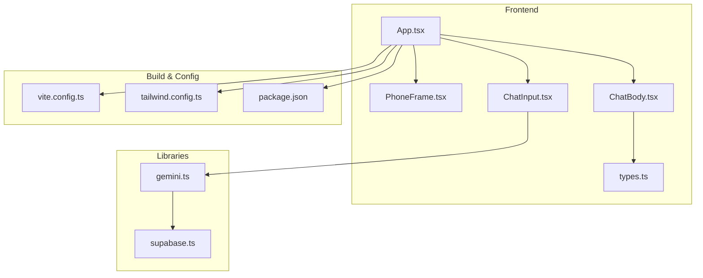
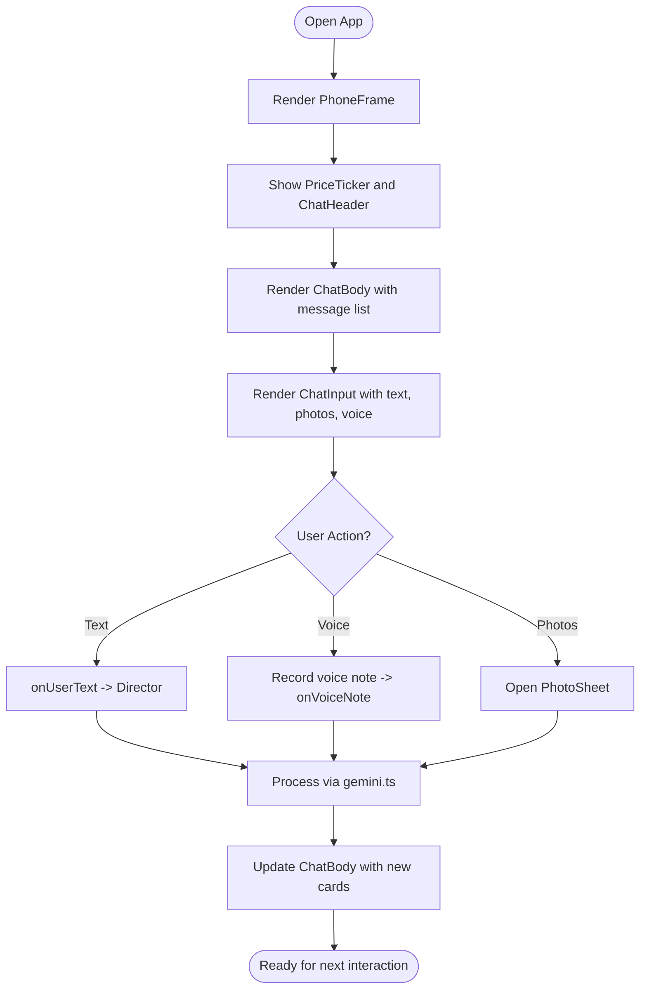
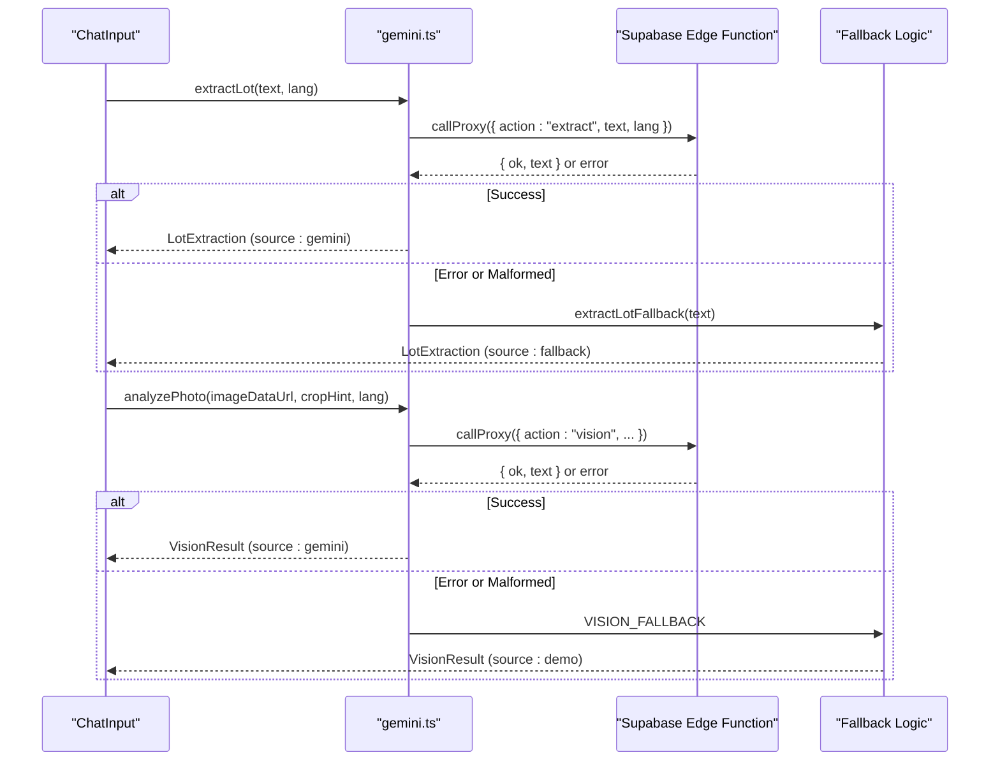
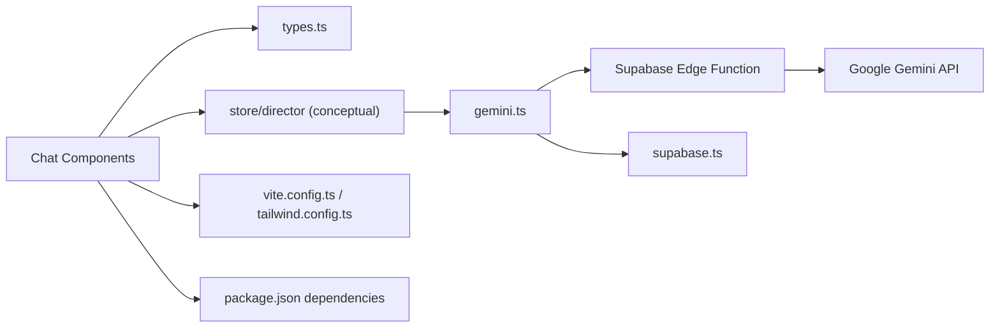

# Project Overview

<cite>
**Referenced Files in This Document**
- [README.md](file://freshroute/README.md)
- [FreshRoute_Agent_PRD.md](file://FreshRoute_Agent_PRD.md)
- [package.json](file://freshroute/package.json)
- [vite.config.ts](file://freshroute/vite.config.ts)
- [tailwind.config.ts](file://freshroute/tailwind.config.ts)
- [App.tsx](file://freshroute/src/App.tsx)
- [main.tsx](file://freshroute/src/main.tsx)
- [types.ts](file://freshroute/src/types.ts)
- [gemini.ts](file://freshroute/src/lib/gemini.ts)
- [supabase.ts](file://freshroute/src/lib/supabase.ts)
- [PhoneFrame.tsx](file://freshroute/src/components/PhoneFrame.tsx)
- [ChatBody.tsx](file://freshroute/src/components/ChatBody.tsx)
- [ChatInput.tsx](file://freshroute/src/components/ChatInput.tsx)
</cite>

## Table of Contents
1. Introduction
2. Project Structure
3. Core Components
4. Architecture Overview
5. Detailed Component Analysis
6. Dependency Analysis
7. Performance Considerations
8. Troubleshooting Guide
9. Conclusion

## Introduction
FreshRoute is an AI-powered agricultural supply chain platform designed to help farmers and agricultural businesses make better, faster decisions about selling perishable produce. It turns simple inputs—text, photos, or voice notes—into structured lot information, analyzes visible quality, compares market prices and logistics options, and guides users through buyer outreach, transport booking, and delivery tracking. The system emphasizes human approval at every commitment step and provides clear explanations for its recommendations.

Target audience:
- Farmers and small-to-medium producers
- Produce traders, commission agents, and collection-center operators
- Buyers such as wholesalers, retailers, processors, and distributors
- Transporters and cold-storage providers

Key benefits:
- Crop quality assessment using multimodal AI analysis of images
- Market intelligence with price trends, buyer demand, and risk-aware comparisons
- Supply chain optimization by comparing sale-now versus store-and-sell-later scenarios, selecting transport and storage, and monitoring execution
- Transparent, explainable recommendations that lead directly to executable actions

Technology stack highlights:
- Frontend: React 19 with TypeScript, Vite build tooling, Tailwind CSS for styling
- Backend integration: Supabase client for environment-backed configuration and future data operations
- AI integration: Google Gemini via a secure proxy (Supabase Edge Function), enabling text extraction, image vision analysis, and conversational agent responses
- Mobile-first design: A phone-framed chat interface optimized for small screens, supporting text, photos, and voice notes

Conceptual overview for beginners:
- FreshRoute acts like a digital assistant for selling fresh produce. You describe what you have, upload photos, or record a voice note. The system identifies the crop, estimates quality, checks current market prices, calculates expected earnings after transport and spoilage, and recommends the best route to sell. You approve each action before anything is sent or booked.

Technical overview for developers:
- Modern web architecture with a component-driven UI, typed state models, and modular libraries for AI and backend integration. The app bootstraps in main.tsx, renders a PhoneFrame-based chat UI in App.tsx, and delegates AI calls to a secure proxy to keep API keys out of the browser bundle.

**Section sources**
- [FreshRoute_Agent_PRD.md:1-30](file://FreshRoute_Agent_PRD.md#L1-L30)
- [package.json:12-23](file://freshroute/package.json#L12-L23)
- [tailwind.config.ts:14-17](file://freshroute/tailwind.config.ts#L14-L17)
- [PhoneFrame.tsx:13-45](file://freshroute/src/components/PhoneFrame.tsx#L13-L45)

## Project Structure
The project is organized into a clean, feature-oriented layout:
- src/components: UI components including chat bubbles, cards, and frames
- src/lib: Integrations for AI (Gemini) and backend (Supabase), plus utilities
- src/store: State management and director logic for orchestrating flows
- supabase: Edge functions and database migrations
- Configuration files for Vite, Tailwind, TypeScript, and linting



**Diagram sources**
- [App.tsx:1-37](file://freshroute/src/App.tsx#L1-L37)
- [PhoneFrame.tsx:1-56](file://freshroute/src/components/PhoneFrame.tsx#L1-L56)
- [ChatBody.tsx:1-85](file://freshroute/src/components/ChatBody.tsx#L1-L85)
- [ChatInput.tsx:1-87](file://freshroute/src/components/ChatInput.tsx#L1-L87)
- [types.ts:1-229](file://freshroute/src/types.ts#L1-L229)
- [gemini.ts:1-200](file://freshroute/src/lib/gemini.ts#L1-L200)
- [supabase.ts:1-20](file://freshroute/src/lib/supabase.ts#L1-L20)
- [vite.config.ts:1-13](file://freshroute/vite.config.ts#L1-L13)
- [tailwind.config.ts:1-138](file://freshroute/tailwind.config.ts#L1-L138)
- [package.json:1-38](file://freshroute/package.json#L1-L38)

**Section sources**
- [App.tsx:1-37](file://freshroute/src/App.tsx#L1-L37)
- [main.tsx:1-11](file://freshroute/src/main.tsx#L1-L11)
- [package.json:1-38](file://freshroute/package.json#L1-L38)

## Core Components
- Chat-based user interface: The app centers around a mobile-first chat experience where users can send text, attach photos, and record voice notes. Messages are rendered as rich cards representing lots, scenarios, approvals, offers, orders, alerts, and summaries.
- AI integration layer: The gemini module handles text extraction, photo vision analysis, and conversational responses via a secure proxy. It includes fallbacks to ensure robustness when live AI services are unavailable.
- Backend configuration: The supabase module initializes the client using environment variables, enabling future data operations and authentication flows.
- Type system: Centralized types define messages, lots, buyers, transporters, scenarios, orders, and audit entries, ensuring consistent data flow across components.

**Section sources**
- [ChatBody.tsx:1-85](file://freshroute/src/components/ChatBody.tsx#L1-L85)
- [ChatInput.tsx:1-87](file://freshroute/src/components/ChatInput.tsx#L1-L87)
- [gemini.ts:1-200](file://freshroute/src/lib/gemini.ts#L1-L200)
- [supabase.ts:1-20](file://freshroute/src/lib/supabase.ts#L1-L20)
- [types.ts:1-229](file://freshroute/src/types.ts#L1-L229)

## Architecture Overview
FreshRoute’s architecture combines a modern frontend with secure server-side AI integration:
- The React application runs on Vite with TypeScript and Tailwind CSS
- User interactions flow through a chat UI that composes message cards and input controls
- AI requests are routed through a Supabase Edge Function proxy to protect API keys and centralize model access
- Data models and state orchestration are defined centrally to maintain consistency across the app

```mermaid
sequenceDiagram
participant User as "User"
participant UI as "ChatInput / ChatBody"
participant App as "App.tsx"
participant AI as "gemini.ts"
participant Proxy as "Supabase Edge Function"
participant Backend as "Supabase Client"
User->>UI : Send text / attach photos / record voice
UI->>App : Dispatch message event
App->>AI : extractLot / analyzePhoto / agentChat
AI->>Proxy : Invoke gemini-proxy with payload
Proxy-->>AI : JSON response or error
AI-->>App : Structured result or fallback
App-->>UI : Render message cards (lot, scenarios, approval, etc.)
Note over AI,Proxy : API keys remain server-side; browser never exposes secrets
```

**Diagram sources**
- [ChatInput.tsx:13-26](file://freshroute/src/components/ChatInput.tsx#L13-L26)
- [ChatBody.tsx:46-80](file://freshroute/src/components/ChatBody.tsx#L46-L80)
- [App.tsx:14-33](file://freshroute/src/App.tsx#L14-L33)
- [gemini.ts:28-42](file://freshroute/src/lib/gemini.ts#L28-L42)
- [gemini.ts:91-116](file://freshroute/src/lib/gemini.ts#L91-L116)
- [gemini.ts:131-161](file://freshroute/src/lib/gemini.ts#L131-L161)
- [gemini.ts:169-182](file://freshroute/src/lib/gemini.ts#L169-L182)
- [supabase.ts:1-20](file://freshroute/src/lib/supabase.ts#L1-L20)

## Detailed Component Analysis

### Chat Interface and Mobile-First Design
The chat interface is built around a phone frame that adapts to screen sizes while keeping the primary interaction area focused on messaging. Users can:
- Type messages and press Enter to send
- Attach photos for visual context
- Record voice notes for low-friction input
- View rich message cards that represent different stages of the workflow (lot details, scenario comparisons, approvals, offers, orders, alerts, summaries)



**Diagram sources**
- [PhoneFrame.tsx:3-53](file://freshroute/src/components/PhoneFrame.tsx#L3-L53)
- [ChatBody.tsx:32-83](file://freshroute/src/components/ChatBody.tsx#L32-L83)
- [ChatInput.tsx:7-87](file://freshroute/src/components/ChatInput.tsx#L7-L87)

**Section sources**
- [PhoneFrame.tsx:1-56](file://freshroute/src/components/PhoneFrame.tsx#L1-L56)
- [ChatBody.tsx:1-85](file://freshroute/src/components/ChatBody.tsx#L1-L85)
- [ChatInput.tsx:1-87](file://freshroute/src/components/ChatInput.tsx#L1-L87)

### AI Integration Layer
The AI layer abstracts calls to Gemini through a secure proxy:
- Text extraction converts natural language into structured lot data (crop, quantity, location, readiness)
- Vision analysis evaluates uploaded images for grade, ripeness, defect rate, and confidence
- Conversational agent responds to user questions with context-aware answers and fallbacks when needed
- Errors are captured and surfaced once by the chat director to avoid silent failures



**Diagram sources**
- [gemini.ts:28-42](file://freshroute/src/lib/gemini.ts#L28-L42)
- [gemini.ts:55-89](file://freshroute/src/lib/gemini.ts#L55-L89)
- [gemini.ts:91-116](file://freshroute/src/lib/gemini.ts#L91-L116)
- [gemini.ts:118-161](file://freshroute/src/lib/gemini.ts#L118-L161)
- [gemini.ts:169-182](file://freshroute/src/lib/gemini.ts#L169-L182)

**Section sources**
- [gemini.ts:1-200](file://freshroute/src/lib/gemini.ts#L1-L200)

### Data Models and Message Types
The type system defines a comprehensive set of structures used throughout the application:
- Roles, profiles, packaging, grades
- Lots with confidence scores and vision results
- Buyers, transporters, storage facilities
- Price points, deductions, scenarios with recommended flags
- Approvals, offers, orders with tracking steps
- Alerts and summaries for operational visibility
- Unified message union type for rendering different card kinds

```mermaid
classDiagram
class Lot {
+string crop
+number quantityKg
+string location
+string readyDate
+Packaging packaging
+boolean storageAvailable
+boolean departEarly
+string[] photos
+VisionResult vision
+LotConfidence confidence
}
class VisionResult {
+Grade grade
+string ripeness
+number defectRate
+string[] notes
+number confidence
+string source
}
class Scenario {
+string id
+string title
+string market
+string destCity
+string buyerName
+number gross
+number acceptedKg
+Deduction[] deductions
+number net
+number spoilagePct
+string risk
+string paymentTerms
+string[] why
+boolean recommended
+number score
}
class Msg {
+string id
+Role role
+string kind
+any payload
+number time
}
Lot --> VisionResult : "has"
Msg --> Lot : "kind : lot"
Msg --> Scenario : "kind : scenarios"
```

**Diagram sources**
- [types.ts:18-45](file://freshroute/src/types.ts#L18-L45)
- [types.ts:94-112](file://freshroute/src/types.ts#L94-L112)
- [types.ts:187-199](file://freshroute/src/types.ts#L187-L199)

**Section sources**
- [types.ts:1-229](file://freshroute/src/types.ts#L1-L229)

### Build and Styling Configuration
- Vite config sets up React plugin and path aliases for cleaner imports
- Tailwind config defines theme extensions, animations, and responsive behavior tailored to a mobile-first chat experience
- Package dependencies include React 19, TypeScript, Vite, Supabase client, Google Gemini SDK, Zustand for state, and utility libraries

**Section sources**
- [vite.config.ts:1-13](file://freshroute/vite.config.ts#L1-L13)
- [tailwind.config.ts:1-138](file://freshroute/tailwind.config.ts#L1-L138)
- [package.json:12-36](file://freshroute/package.json#L12-L36)

## Dependency Analysis
The application’s dependencies form a layered architecture:
- UI layer depends on typed models and reusable components
- AI layer depends on Supabase Edge Functions to securely call Gemini
- Backend configuration depends on environment variables for credentials
- Build tools depend on plugins and configurations for development and production builds



**Diagram sources**
- [ChatBody.tsx:1-85](file://freshroute/src/components/ChatBody.tsx#L1-L85)
- [types.ts:1-229](file://freshroute/src/types.ts#L1-L229)
- [gemini.ts:1-200](file://freshroute/src/lib/gemini.ts#L1-L200)
- [supabase.ts:1-20](file://freshroute/src/lib/supabase.ts#L1-L20)
- [vite.config.ts:1-13](file://freshroute/vite.config.ts#L1-L13)
- [tailwind.config.ts:1-138](file://freshroute/tailwind.config.ts#L1-L138)
- [package.json:12-36](file://freshroute/package.json#L12-L36)

**Section sources**
- [package.json:12-36](file://freshroute/package.json#L12-L36)
- [gemini.ts:28-42](file://freshroute/src/lib/gemini.ts#L28-L42)
- [supabase.ts:1-20](file://freshroute/src/lib/supabase.ts#L1-L20)

## Performance Considerations
- Keep AI payloads concise to reduce latency and costs; prefer structured prompts and minimal image data
- Use fallback modes gracefully to maintain responsiveness when AI services are unavailable
- Debounce or throttle repeated AI calls during rapid user input
- Cache static assets and leverage Vite’s build optimizations for faster load times
- Prefer server-side processing for heavy computations; offload to Edge Functions where possible

[No sources needed since this section provides general guidance]

## Troubleshooting Guide
Common issues and strategies:
- AI proxy unreachable: The gemini module surfaces errors and falls back to deterministic logic; check network connectivity and Edge Function status
- Malformed AI responses: Parsing errors trigger fallbacks; validate JSON structure from the proxy and refine prompts
- Missing environment variables: Ensure Supabase URL and anon key are configured; the client will use placeholders if not present
- Image analysis failures: Validate base64 encoding and MIME type; ensure images meet size and format constraints

**Section sources**
- [gemini.ts:28-42](file://freshroute/src/lib/gemini.ts#L28-L42)
- [gemini.ts:91-116](file://freshroute/src/lib/gemini.ts#L91-L116)
- [gemini.ts:131-161](file://freshroute/src/lib/gemini.ts#L131-L161)
- [supabase.ts:1-20](file://freshroute/src/lib/supabase.ts#L1-L20)

## Conclusion
FreshRoute delivers a practical, AI-powered solution for agricultural supply chains, focusing on actionable insights and transparent decision-making. Its mobile-first chat interface lowers barriers to entry for farmers and traders, while its modern web architecture ensures scalability and maintainability. By integrating Google Gemini through a secure proxy and leveraging Supabase for backend capabilities, the platform balances innovation with reliability. The result is a system that helps users optimize crop sales, reduce spoilage, and improve logistics efficiency with clear, explainable recommendations and explicit user control.

[No sources needed since this section summarizes without analyzing specific files]