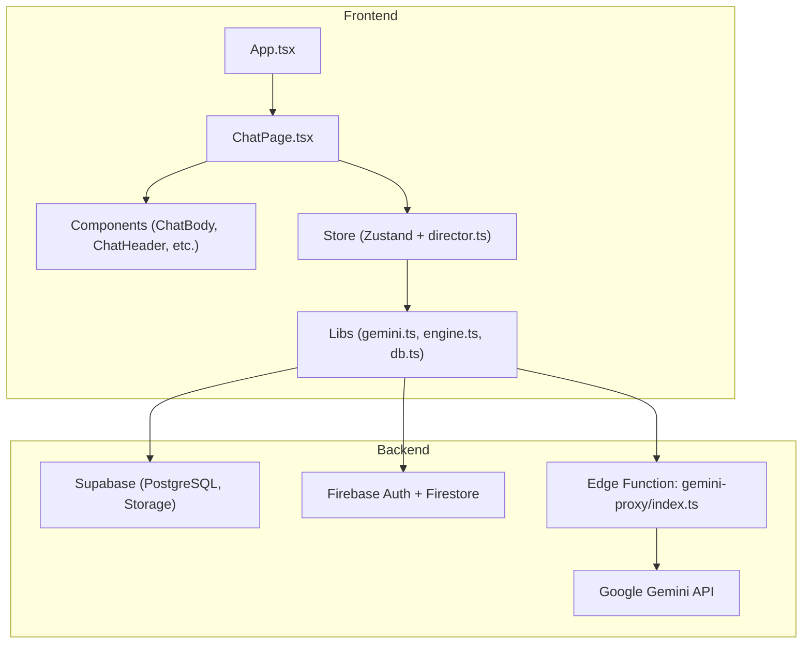
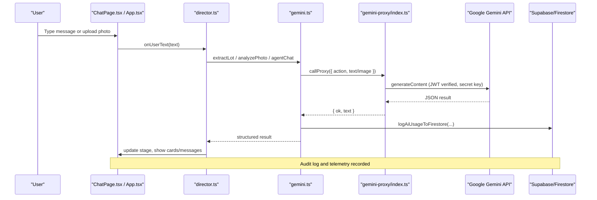
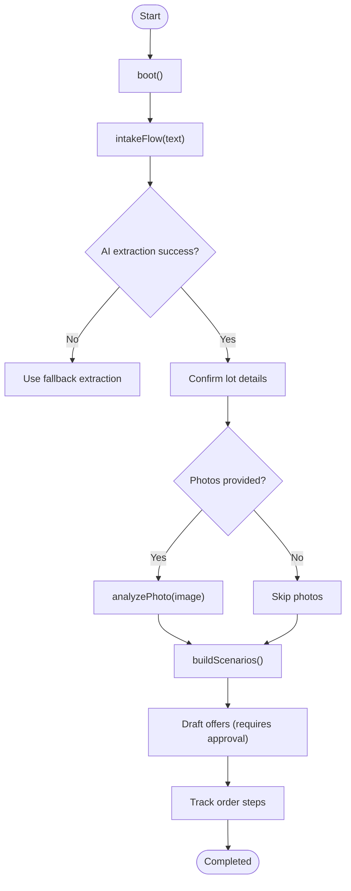
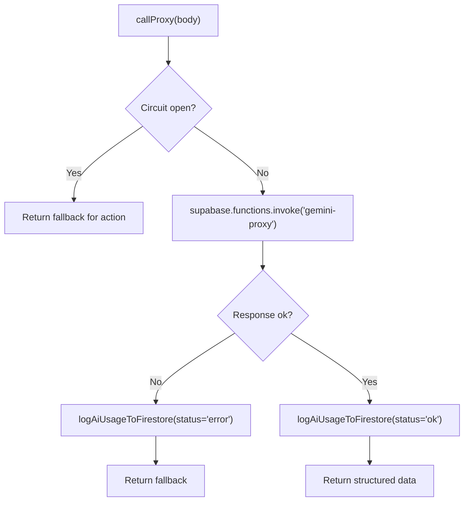
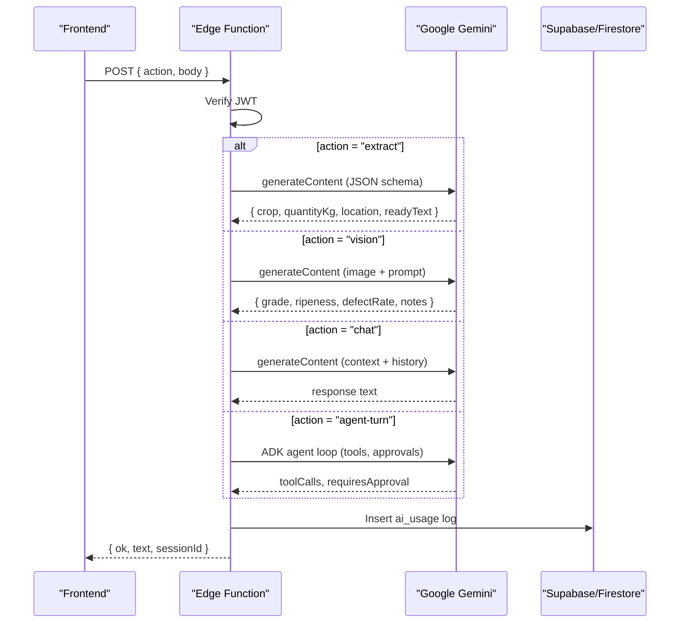
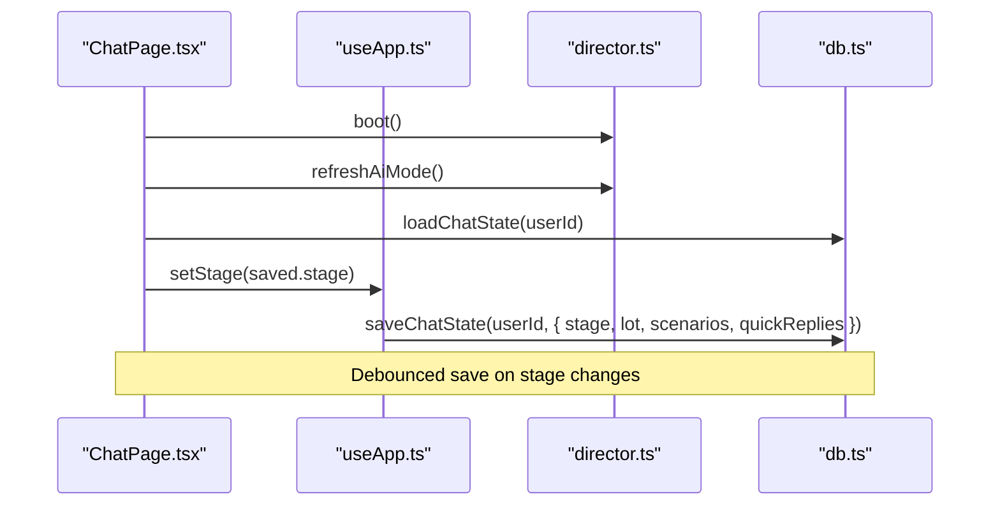
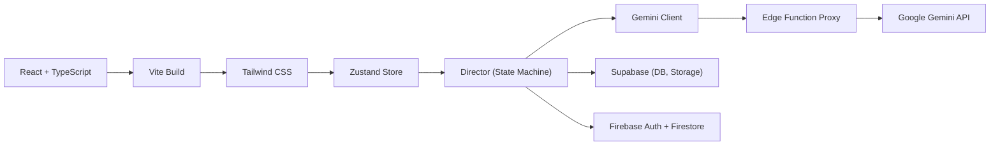

# Demo Video Script

<cite>
**Referenced Files in This Document**
- [README.md](file://README.md)
- [DEMO_VIDEO_SCRIPT.md](file://DEMO_VIDEO_SCRIPT.md)
- [EXPLANATION_SCRIPT.md](file://EXPLANATION_SCRIPT.md)
- [package.json](file://freshroute/package.json)
- [App.tsx](file://freshroute/src/App.tsx)
- [ChatPage.tsx](file://freshroute/src/pages/ChatPage.tsx)
- [director.ts](file://freshroute/src/store/director.ts)
- [gemini.ts](file://freshroute/src/lib/gemini.ts)
- [index.ts](file://freshroute/supabase/functions/gemini-proxy/index.ts)
</cite>

## Table of Contents
1. [Introduction](#introduction)
2. [Project Structure](#project-structure)
3. [Core Components](#core-components)
4. [Architecture Overview](#architecture-overview)
5. [Detailed Component Analysis](#detailed-component-analysis)
6. [Dependency Analysis](#dependency-analysis)
7. [Performance Considerations](#performance-considerations)
8. [Troubleshooting Guide](#troubleshooting-guide)
9. [Conclusion](#conclusion)
10. [Appendices](#appendices)

## Introduction
This document provides a production-ready demo video script and supporting technical context for FreshRoute Agent, an AI-powered produce trading assistant designed for Pakistani farmers and traders. It consolidates the official demo script with architecture, data flows, and implementation details so you can record a clear, accurate 3–4 minute walkthrough that demonstrates both user experience and backend infrastructure.

The demo covers:
- The problem and value proposition
- A live chat flow from lot intake to order tracking
- Bilingual support (English/Urdu)
- Approval-first design at every financial step
- Real-time telemetry via Google Cloud Firestore
- Secure Gemini integration through a Supabase Edge Function proxy

**Section sources**
- [README.md:48-141](file://README.md#L48-L141)
- [DEMO_VIDEO_SCRIPT.md:10-159](file://DEMO_VIDEO_SCRIPT.md#L10-L159)

## Project Structure
FreshRoute is a React + TypeScript frontend built with Vite, Zustand state management, Tailwind CSS, and integrated with Supabase (PostgreSQL, Storage, Edge Functions), Firebase Auth/Firestore, and Google Gemini via a secure proxy.

Key directories:
- src/components: UI components including chat interface, cards, layout, and settings
- src/pages: Route-based pages such as Chat, Dashboard, Admin, Orders
- src/store: State machine (director) and global store
- src/lib: Business logic, AI client, database helpers, formatting utilities
- supabase/functions: Server-side Edge Functions (Gemini proxy)
- supabase/migrations: Database schema and seed data

**Diagram sources**
- [App.tsx:14-33](file://freshroute/src/App.tsx#L14-L33)
- [ChatPage.tsx:15-84](file://freshroute/src/pages/ChatPage.tsx#L15-L84)
- [director.ts:100-125](file://freshroute/src/store/director.ts#L100-L125)
- [gemini.ts:50-98](file://freshroute/src/lib/gemini.ts#L50-L98)
- [index.ts:64-143](file://freshroute/supabase/functions/gemini-proxy/index.ts#L64-L143)

**Section sources**
- [README.md:337-444](file://README.md#L337-L444)
- [package.json:12-56](file://freshroute/package.json#L12-L56)

## Core Components
- Conversation Director: A state machine orchestrating the entire workflow from welcome to completed, handling AI calls, approvals, and persistence.
- Gemini Client: Encapsulates all AI interactions with circuit breaker protection, fallback modes, and telemetry logging.
- Edge Function Proxy: Secures the Gemini API key server-side, verifies caller JWT, logs usage, and supports extract, vision, chat, and agent-turn actions.
- Pages and Components: Chat-centric UI with real-time status, bilingual toggle, photo upload, quick replies, and audit log drawer.

**Section sources**
- [director.ts:100-200](file://freshroute/src/store/director.ts#L100-L200)
- [gemini.ts:50-98](file://freshroute/src/lib/gemini.ts#L50-L98)
- [index.ts:145-381](file://freshroute/supabase/functions/gemini-proxy/index.ts#L145-L381)
- [ChatPage.tsx:15-84](file://freshroute/src/pages/ChatPage.tsx#L15-L84)

## Architecture Overview
The system follows an approval-first design with graceful degradation. All AI traffic goes through a server-side proxy that validates requests and logs usage. The frontend uses a state machine to guide users through intake, analysis, scenarios, outreach, booking, and tracking.

**Diagram sources**
- [ChatPage.tsx:18-43](file://freshroute/src/pages/ChatPage.tsx#L18-L43)
- [director.ts:175-200](file://freshroute/src/store/director.ts#L175-L200)
- [gemini.ts:50-98](file://freshroute/src/lib/gemini.ts#L50-L98)
- [index.ts:64-143](file://freshroute/supabase/functions/gemini-proxy/index.ts#L64-L143)

## Detailed Component Analysis

### Conversation Director (State Machine)
The director manages the conversation lifecycle:
- Boot: Initializes session, greets user, sets initial quick replies
- Intake Flow: Extracts lot data via Gemini or fallback, confirms details, prompts for photos
- Scenario Generation: Computes market options, ranks by net revenue
- Outreach & Approvals: Drafts buyer messages; requires explicit approval before sending
- Tracking: Moves orders through pickup → transit → delivery → payment

**Diagram sources**
- [director.ts:100-125](file://freshroute/src/store/director.ts#L100-L125)
- [director.ts:129-173](file://freshroute/src/store/director.ts#L129-L173)
- [gemini.ts:155-180](file://freshroute/src/lib/gemini.ts#L155-L180)

**Section sources**
- [director.ts:100-200](file://freshroute/src/store/director.ts#L100-L200)

### Gemini Client and Fallbacks
The Gemini client centralizes AI calls with robust error handling:
- Circuit Breaker: Prevents cascading failures when the proxy is down
- Fallback Modes: Deterministic extraction, description-only quality estimation, scripted chat responses
- Telemetry: Logs action type, model, status, latency to Firestore for live monitoring

**Diagram sources**
- [gemini.ts:50-98](file://freshroute/src/lib/gemini.ts#L50-L98)
- [gemini.ts:120-153](file://freshroute/src/lib/gemini.ts#L120-L153)
- [gemini.ts:195-225](file://freshroute/src/lib/gemini.ts#L195-L225)

**Section sources**
- [gemini.ts:50-98](file://freshroute/src/lib/gemini.ts#L50-L98)
- [gemini.ts:120-153](file://freshroute/src/lib/gemini.ts#L120-L153)
- [gemini.ts:195-225](file://freshroute/src/lib/gemini.ts#L195-L225)

### Edge Function Proxy (Server-Side Security)
The Edge Function ensures:
- JWT verification for every request
- Secret storage for Gemini API key (never exposed to browser)
- Action routing: extract, vision, chat, agent-turn, status
- Usage logging to Supabase and Firestore

**Diagram sources**
- [index.ts:64-143](file://freshroute/supabase/functions/gemini-proxy/index.ts#L64-L143)
- [index.ts:145-381](file://freshroute/supabase/functions/gemini-proxy/index.ts#L145-L381)

**Section sources**
- [index.ts:64-143](file://freshroute/supabase/functions/gemini-proxy/index.ts#L64-L143)
- [index.ts:145-381](file://freshroute/supabase/functions/gemini-proxy/index.ts#L145-L381)

### Frontend Chat Interface
The chat page initializes the app, boots the director, refreshes AI mode, and persists chat state:
- Auto-rechecks AI status on tab visibility change
- Loads and saves chat state to database for session recovery
- Renders phone frame, price ticker, header, body, quick replies, input, sheets, and audit drawer

**Diagram sources**
- [ChatPage.tsx:18-69](file://freshroute/src/pages/ChatPage.tsx#L18-L69)
- [App.tsx:14-33](file://freshroute/src/App.tsx#L14-L33)

**Section sources**
- [ChatPage.tsx:15-84](file://freshroute/src/pages/ChatPage.tsx#L15-L84)
- [App.tsx:14-33](file://freshroute/src/App.tsx#L14-L33)

## Dependency Analysis
Dependencies are organized by role:
- Frontend dependencies include React, TypeScript, Vite, Tailwind, Zustand, Recharts, Firebase, Supabase, and Gemini SDKs
- Backend runtime uses Deno for Edge Functions with Supabase JS client and Google ADK tools
- Data layer integrates Supabase PostgreSQL and Firestore for telemetry

**Diagram sources**
- [package.json:12-56](file://freshroute/package.json#L12-L56)
- [index.ts:8-14](file://freshroute/supabase/functions/gemini-proxy/index.ts#L8-L14)

**Section sources**
- [package.json:12-56](file://freshroute/package.json#L12-L56)

## Performance Considerations
- Circuit Breaker: Protects against repeated failures to Gemini proxy
- Debounced Persistence: Reduces database writes during rapid state changes
- Fallback Modes: Ensures usability when AI is unavailable
- Efficient Logging: Non-blocking Firestore writes for telemetry
- Image Handling: Base64 constraints and MIME validation prevent oversized payloads

[No sources needed since this section provides general guidance]

## Troubleshooting Guide
Common issues and resolutions:
- AI badge shows ERROR: Ensure Edge Function deployed and secrets configured
- Firestore writes fail: Deploy security rules and verify permissions
- Voice input not working: Use Chrome or Edge; Web Speech API not supported in Safari/Firefox
- Empty dashboard after signup: Run seed migrations or create first lot via chat
- Admin link missing: Update role and re-login

**Section sources**
- [README.md:692-704](file://README.md#L692-L704)

## Conclusion
FreshRoute Agent delivers a complete, approval-first trading workflow powered by Google Gemini, secured by a server-side Edge Function, and monitored in real-time via Firestore. The demo script guides viewers through the problem, solution, live app features, and backend proof, ensuring clarity and credibility for stakeholders and users alike.

[No sources needed since this section summarizes without analyzing specific files]

## Appendices

### Demo Video Script Highlights
- Target length: ~3 minutes 30 seconds
- Segments: Problem, Value Proposition, Live App Demo, Google Cloud Proof, Closing
- Recording checklist and timing guide included for production readiness

**Section sources**
- [DEMO_VIDEO_SCRIPT.md:1-205](file://DEMO_VIDEO_SCRIPT.md#L1-L205)

### How I Built It — Technical Deep Dive
- Architecture overview with state machine and Gemini integration
- Calculation engine for spoilage and net revenue
- Technologies used and rationale
- Lessons learned and future roadmap

**Section sources**
- [EXPLANATION_SCRIPT.md:49-240](file://EXPLANATION_SCRIPT.md#L49-L240)