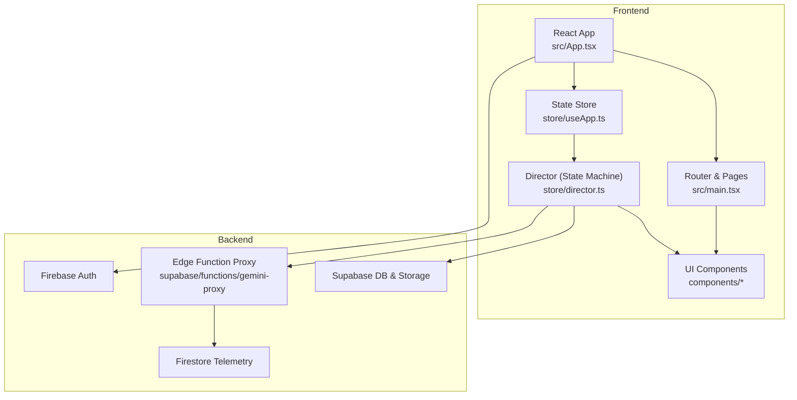
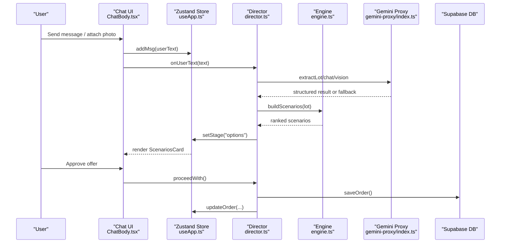
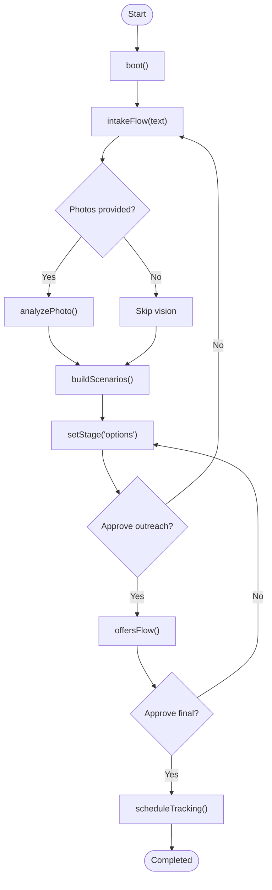
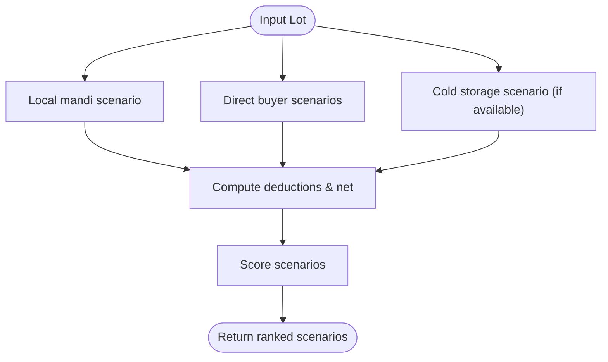
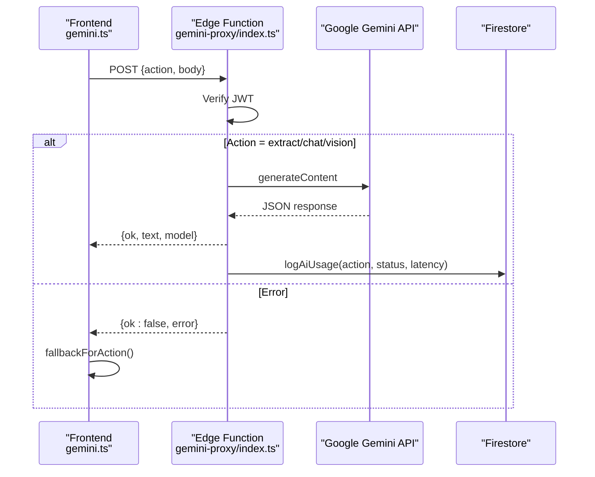
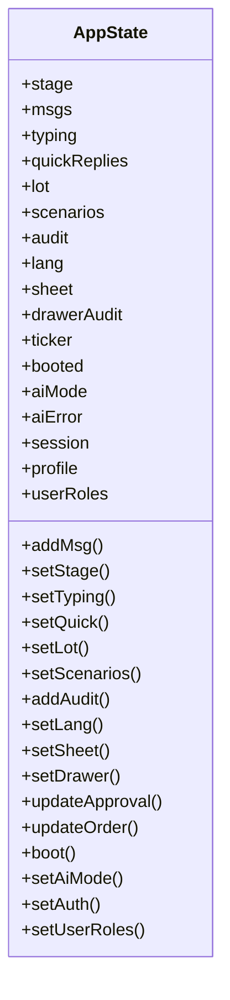
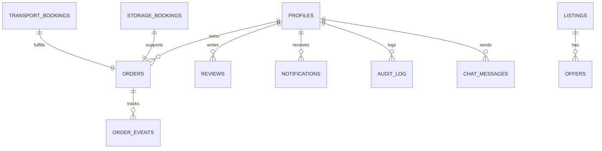
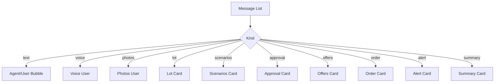
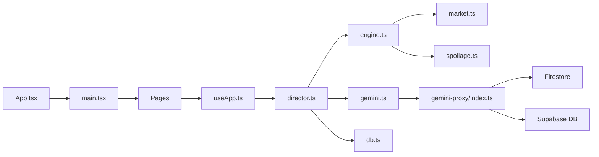

# Technical Explanation Script

<cite>
**Referenced Files in This Document**
- [README.md](file://freshroute/README.md)
- [package.json](file://freshroute/package.json)
- [App.tsx](file://freshroute/src/App.tsx)
- [main.tsx](file://freshroute/src/main.tsx)
- [types.ts](file://freshroute/src/types.ts)
- [director.ts](file://freshroute/src/store/director.ts)
- [useApp.ts](file://freshroute/src/store/useApp.ts)
- [engine.ts](file://freshroute/src/lib/engine.ts)
- [gemini.ts](file://freshroute/src/lib/gemini.ts)
- [db.ts](file://freshroute/src/lib/db.ts)
- [market.ts](file://freshroute/src/data/market.ts)
- [ChatBody.tsx](file://freshroute/src/components/ChatBody.tsx)
- [0001_init.sql](file://freshroute/supabase/migrations/0001_init.sql)
- [gemini-proxy/index.ts](file://freshroute/supabase/functions/gemini-proxy/index.ts)
</cite>

## Table of Contents
1. Introduction
2. Project Structure
3. Core Components
4. Architecture Overview
5. Detailed Component Analysis
6. Dependency Analysis
7. Performance Considerations
8. Troubleshooting Guide
9. Conclusion

## Introduction
FreshRoute Agent is an AI-powered produce trading assistant for Pakistani farmers and traders. It turns natural-language messages into structured lot data, analyzes photos for quality, compares real-time market prices across cities, estimates spoilage risk, finds matching buyers and logistics providers, and recommends execution plans — all within a conversational interface with explicit user approval at every financial step.

Key characteristics:
- Approval-first workflow: no outbound action without user consent
- Graceful degradation to demo mode when AI is unavailable
- Server-side Gemini API key security via Supabase Edge Function proxy
- Row-level security on all database tables
- Audit trail for all actions
- Real-time telemetry via Firestore for admin monitoring

**Section sources**
- [README.md:50-262](file://freshroute/README.md#L50-L262)

## Project Structure
The application is a React 19 + TypeScript frontend built with Vite, styled with Tailwind CSS, and uses Zustand for state management. Routing is handled by React Router with lazy-loaded pages. The backend integrates Supabase (PostgreSQL, Storage, Edge Functions), Firebase Auth, and Google Gemini via a secure Edge Function proxy.

Highlights:
- src/pages: route-based UI modules (chat, dashboard, orders, admin)
- src/components: reusable UI and domain-specific cards (lot, scenarios, offers, approvals)
- src/store: conversation director (state machine) and global store
- src/lib: business logic (engine, gemini client, db, rate limiter, circuit breaker)
- supabase/functions: server-side Gemini proxy with JWT verification and ADK agent tools
- supabase/migrations: incremental schema evolution with RLS policies

**Diagram sources**
- [App.tsx:14-33](file://freshroute/src/App.tsx#L14-L33)
- [main.tsx:50-101](file://freshroute/src/main.tsx#L50-L101)
- [useApp.ts:60-124](file://freshroute/src/store/useApp.ts#L60-L124)
- [director.ts:100-200](file://freshroute/src/store/director.ts#L100-L200)
- [gemini-proxy/index.ts:64-143](file://freshroute/supabase/functions/gemini-proxy/index.ts#L64-L143)

**Section sources**
- [README.md:377-534](file://freshroute/README.md#L377-L534)
- [package.json:1-73](file://freshroute/package.json#L1-L73)

## Core Components
- Conversation Director: orchestrates the full lifecycle from intake to tracking using a state machine, integrating AI extraction, vision analysis, scenario generation, approvals, and order booking.
- Calculation Engine: deterministic pricing, spoilage estimation, transport options, and scenario scoring.
- Gemini Client Abstraction: proxies all AI calls through a secure Edge Function, with fallbacks and circuit breaking.
- Global Store: centralized Zustand state for chat messages, stage, audit log, language, and session.
- Database Layer: typed operations over Supabase tables with RLS enforcement.
- Market Data: static price tables, distances, buyer/transporter/storage profiles, weather, and perishability profiles.

**Section sources**
- [director.ts:100-200](file://freshroute/src/store/director.ts#L100-L200)
- [engine.ts:14-200](file://freshroute/src/lib/engine.ts#L14-L200)
- [gemini.ts:50-106](file://freshroute/src/lib/gemini.ts#L50-L106)
- [useApp.ts:21-124](file://freshroute/src/store/useApp.ts#L21-L124)
- [db.ts:47-114](file://freshroute/src/lib/db.ts#L47-L114)
- [market.ts:5-24](file://freshroute/src/data/market.ts#L5-L24)

## Architecture Overview
The system follows a layered architecture:
- Presentation: React components render chat bubbles, cards, and pages.
- State & Flow: Zustand store holds UI state; Director manages conversation flow and transitions.
- Business Logic: Engine computes scenarios, spoilage, and transport options; Matching algorithms score buyers/providers.
- Integration: Supabase for persistence and auth; Edge Function proxy for Gemini; Firestore for telemetry.

**Diagram sources**
- [ChatBody.tsx:32-85](file://freshroute/src/components/ChatBody.tsx#L32-L85)
- [useApp.ts:80-124](file://freshroute/src/store/useApp.ts#L80-L124)
- [director.ts:129-200](file://freshroute/src/store/director.ts#L129-L200)
- [engine.ts:76-200](file://freshroute/src/lib/engine.ts#L76-L200)
- [gemini-proxy/index.ts:145-236](file://freshroute/supabase/functions/gemini-proxy/index.ts#L145-L236)
- [db.ts:76-114](file://freshroute/src/lib/db.ts#L76-L114)

## Detailed Component Analysis

### Conversation Director (State Machine)
Responsibilities:
- Boot session and greet user
- Intake flow: parse text, extract lot details, request photos
- Vision analysis: analyze uploaded images for grade and defects
- Scenario generation: compute sell-now vs store-and-sell-later options
- Outreach approval: draft buyer outreach with explicit consent
- Offers flow: present transport quotes and expected net
- Final approval: book order, persist to DB, initiate tracking
- Chat flow: free-form Q&A with guardrails

**Diagram sources**
- [director.ts:100-200](file://freshroute/src/store/director.ts#L100-L200)
- [engine.ts:76-200](file://freshroute/src/lib/engine.ts#L76-L200)

**Section sources**
- [director.ts:100-200](file://freshroute/src/store/director.ts#L100-L200)

### Calculation Engine
Responsibilities:
- Generate market scenarios per destination city
- Estimate spoilage using exponential decay model and crop-specific perishability
- Score scenarios based on net revenue, acceptance rates, and risk
- Provide transport options and cost calculations
- Apply grade-based price factors and platform fees

**Diagram sources**
- [engine.ts:76-200](file://freshroute/src/lib/engine.ts#L76-L200)

**Section sources**
- [engine.ts:14-200](file://freshroute/src/lib/engine.ts#L14-L200)
- [market.ts:5-24](file://freshroute/src/data/market.ts#L5-L24)

### Gemini Client Abstraction and Edge Function Proxy
Responsibilities:
- Sanitize user input to prevent prompt injection
- Call Edge Function with JWT authentication
- Log usage metrics to Firestore
- Provide robust fallbacks (demo mode) when AI is unreachable
- Support extract, vision, chat, and agent-turn actions

**Diagram sources**
- [gemini.ts:50-106](file://freshroute/src/lib/gemini.ts#L50-L106)
- [gemini-proxy/index.ts:64-143](file://freshroute/supabase/functions/gemini-proxy/index.ts#L64-L143)
- [gemini-proxy/index.ts:145-236](file://freshroute/supabase/functions/gemini-proxy/index.ts#L145-L236)

**Section sources**
- [gemini.ts:35-106](file://freshroute/src/lib/gemini.ts#L35-L106)
- [gemini-proxy/index.ts:64-143](file://freshroute/supabase/functions/gemini-proxy/index.ts#L64-L143)

### Global Store (Zustand)
Responsibilities:
- Manage conversation stage, messages, typing indicators, quick replies
- Maintain lot, scenarios, audit entries, language, and sheet visibility
- Persist session and profile info
- Provide helper functions to append messages and update approvals/orders

**Diagram sources**
- [useApp.ts:21-124](file://freshroute/src/store/useApp.ts#L21-L124)

**Section sources**
- [useApp.ts:21-124](file://freshroute/src/store/useApp.ts#L21-L124)

### Database Schema and Migrations
Core tables include profiles, orders, reviews, notifications, audit_log, chat_messages, image_analyses, ai_usage, plus marketplace tables for listings, offers, bookings, and recommendations. All tables enforce Row Level Security. Triggers auto-create profiles and assign roles.

**Diagram sources**
- [0001_init.sql:26-200](file://freshroute/supabase/migrations/0001_init.sql#L26-L200)

**Section sources**
- [0001_init.sql:26-200](file://freshroute/supabase/migrations/0001_init.sql#L26-L200)
- [README.md:615-684](file://freshroute/README.md#L615-L684)

### UI Rendering and Message Handling
ChatBody renders different message kinds (text, voice, photos, lot, clarify, scenarios, approval, offers, order, alert, summary). It scrolls to the latest message and shows typing indicators with contextual labels.

**Diagram sources**
- [ChatBody.tsx:32-85](file://freshroute/src/components/ChatBody.tsx#L32-L85)

**Section sources**
- [ChatBody.tsx:32-85](file://freshroute/src/components/ChatBody.tsx#L32-L85)

## Dependency Analysis
Key dependencies and relationships:
- App entry mounts router and routes to protected and public pages
- Director depends on engine, gemini client, format utilities, i18n, and db layer
- Engine depends on market data, spoilage model, and db for saving assessments/recommendations
- Gemini client depends on Supabase functions invocation and Firestore logging
- DB layer abstracts Supabase queries and maps rows to domain types

**Diagram sources**
- [App.tsx:14-33](file://freshroute/src/App.tsx#L14-L33)
- [main.tsx:50-101](file://freshroute/src/main.tsx#L50-L101)
- [director.ts:100-200](file://freshroute/src/store/director.ts#L100-L200)
- [engine.ts:76-200](file://freshroute/src/lib/engine.ts#L76-L200)
- [gemini.ts:50-106](file://freshroute/src/lib/gemini.ts#L50-L106)
- [gemini-proxy/index.ts:64-143](file://freshroute/supabase/functions/gemini-proxy/index.ts#L64-L143)

**Section sources**
- [package.json:12-56](file://freshroute/package.json#L12-L56)

## Performance Considerations
- Lazy loading of pages reduces initial bundle size
- Circuit breaker protects against cascading failures when AI proxy is down
- Rate limiting prevents abuse and ensures fair usage
- Efficient rendering of chat messages avoids unnecessary re-renders
- Deterministic calculations in engine minimize expensive recomputations
- Firestore telemetry is fire-and-forget to avoid blocking critical paths

[No sources needed since this section provides general guidance]

## Troubleshooting Guide
Common issues and resolutions:
- AI proxy unreachable: check Edge Function deployment and secrets; app falls back to demo mode automatically
- Invalid or expired session: ensure Supabase JWT is valid; Edge Function rejects invalid tokens
- Malformed AI response: director surfaces errors and uses fallback extraction
- Rate limit reached: user sees retry-after guidance; reduce interaction frequency
- Database RLS errors: verify row ownership and admin privileges; use service role only in server code

**Section sources**
- [gemini.ts:50-106](file://freshroute/src/lib/gemini.ts#L50-L106)
- [gemini-proxy/index.ts:64-143](file://freshroute/supabase/functions/gemini-proxy/index.ts#L64-L143)
- [director.ts:76-88](file://freshroute/src/store/director.ts#L76-L88)

## Conclusion
FreshRoute Agent combines a robust conversational state machine, deterministic business logic, and secure AI integration to streamline produce trading for farmers. Its approval-first design, graceful fallbacks, and comprehensive audit trails ensure trust and reliability. The modular architecture enables easy extension of capabilities such as additional markets, crops, and provider matching strategies.

[No sources needed since this section summarizes without analyzing specific files]