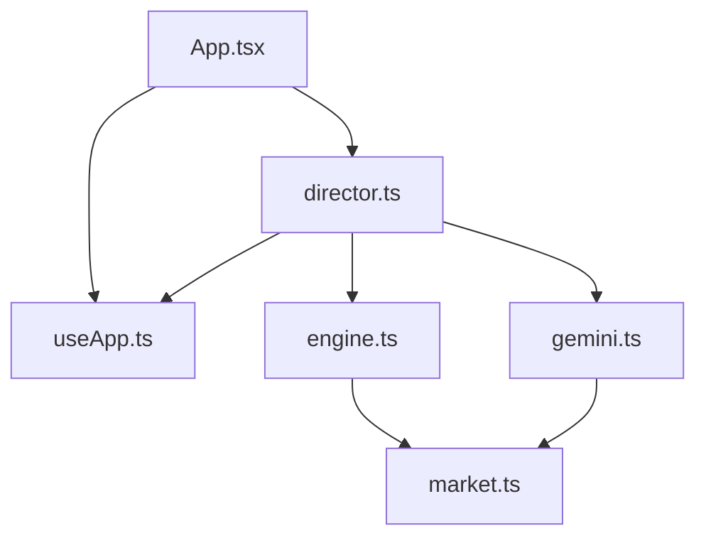
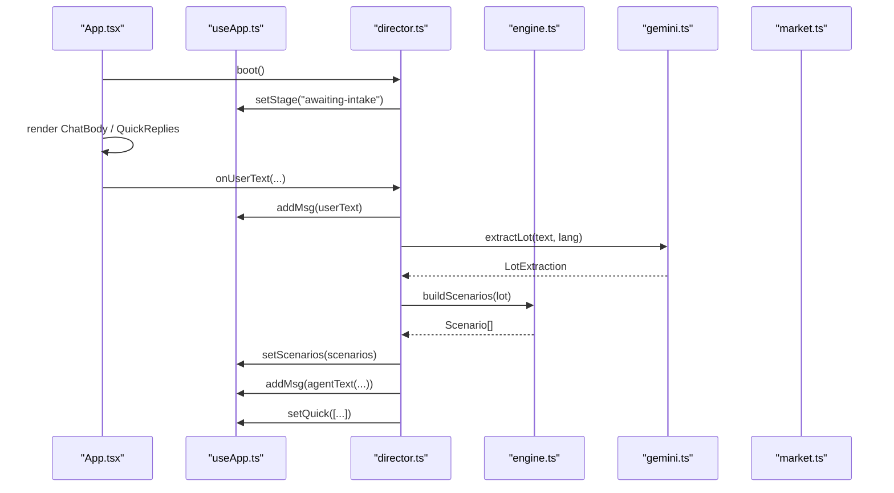
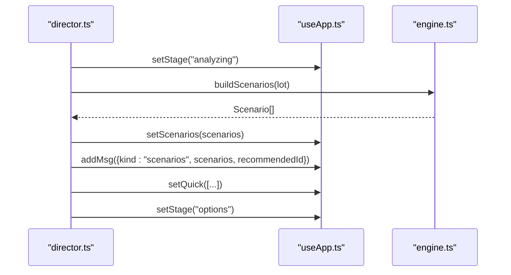
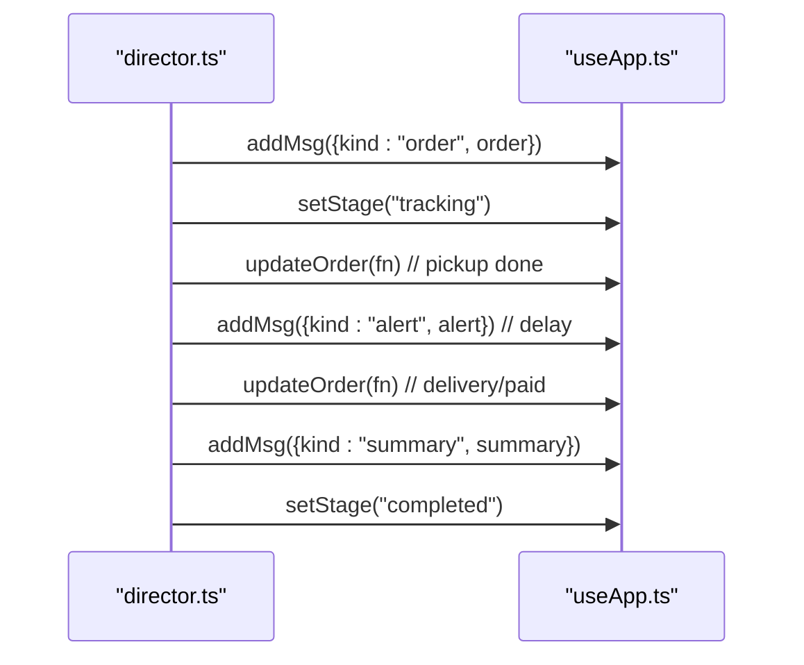
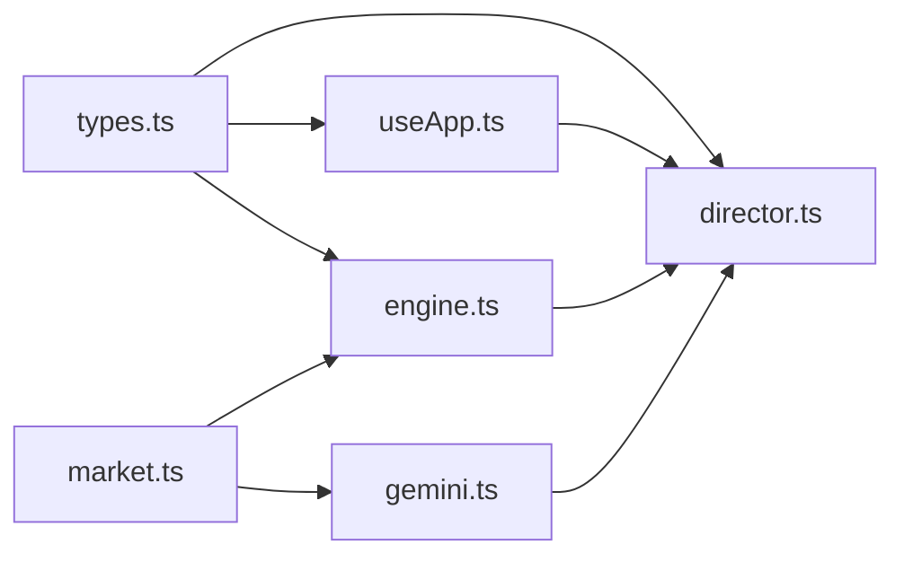

# State Management

<cite>
**Referenced Files in This Document**
- [useApp.ts](file://freshroute/src/store/useApp.ts)
- [director.ts](file://freshroute/src/store/director.ts)
- [types.ts](file://freshroute/src/types.ts)
- [engine.ts](file://freshroute/src/lib/engine.ts)
- [gemini.ts](file://freshroute/src/lib/gemini.ts)
- [market.ts](file://freshroute/src/data/market.ts)
- [App.tsx](file://freshroute/src/App.tsx)
- [package.json](file://freshroute/package.json)
</cite>

## Table of Contents
1. [Introduction](#introduction)
2. [Project Structure](#project-structure)
3. [Core Components](#core-components)
4. [Architecture Overview](#architecture-overview)
5. [Detailed Component Analysis](#detailed-component-analysis)
6. [Dependency Analysis](#dependency-analysis)
7. [Performance Considerations](#performance-considerations)
8. [Troubleshooting Guide](#troubleshooting-guide)
9. [Conclusion](#conclusion)

## Introduction
This document explains FreshRoute’s Zustand-based state management system and the director pattern used to orchestrate workflows across chat messages, lot information, scenarios, orders, and audit trails. It covers the main store shape, actions, reducers, type safety with TypeScript, subscription patterns, performance considerations, and debugging techniques for complex interactions.

## Project Structure
The state management is centered around a single Zustand store and a director module that orchestrates user flows:
- Store definition and actions live in the store module.
- The director coordinates multi-step workflows (intake, photo analysis, scenario generation, outreach approval, offers, order creation, tracking, completion).
- Types define the domain model for messages, lots, scenarios, orders, audits, and UI states.
- Supporting libraries provide market data, scenario engine logic, and AI integration via a proxy.

**Diagram sources**
- [App.tsx:1-37](file://freshroute/src/App.tsx#L1-L37)
- [useApp.ts:1-129](file://freshroute/src/store/useApp.ts#L1-L129)
- [director.ts:1-750](file://freshroute/src/store/director.ts#L1-L750)
- [engine.ts:1-258](file://freshroute/src/lib/engine.ts#L1-L258)
- [gemini.ts:1-200](file://freshroute/src/lib/gemini.ts#L1-L200)
- [market.ts:1-189](file://freshroute/src/data/market.ts#L1-L189)

**Section sources**
- [App.tsx:1-37](file://freshroute/src/App.tsx#L1-L37)
- [useApp.ts:1-129](file://freshroute/src/store/useApp.ts#L1-L129)
- [director.ts:1-750](file://freshroute/src/store/director.ts#L1-L750)
- [engine.ts:1-258](file://freshroute/src/lib/engine.ts#L1-L258)
- [gemini.ts:1-200](file://freshroute/src/lib/gemini.ts#L1-L200)
- [market.ts:1-189](file://freshroute/src/data/market.ts#L1-L189)

## Core Components
- useApp store: Centralized Zustand store holding application state and actions for messages, stages, lot details, scenarios, orders, audit logs, language, UI sheets, ticker prices, boot flag, AI mode/error, session, and profile.
- Director: Workflow orchestrator that transitions the app through stages, updates messages, sets quick replies, manages approvals, generates scenarios, creates orders, schedules tracking events, and surfaces alerts and summaries.
- Types: Strongly-typed interfaces for all domain entities and message variants ensuring compile-time safety across the app.

Key responsibilities:
- Message history and typing indicators drive UI feedback during async operations.
- Lot intake and vision analysis produce structured lot objects with confidence metrics.
- Scenario engine computes sale options with deductions, risk, and scoring.
- Approval requests gate outbound communications; outcomes update messages and audit trail.
- Orders encapsulate buyer, transporter, pricing, and step-by-step tracking.
- Audit entries record every significant action by users, agent, or system.

**Section sources**
- [useApp.ts:20-118](file://freshroute/src/store/useApp.ts#L20-L118)
- [director.ts:84-750](file://freshroute/src/store/director.ts#L84-L750)
- [types.ts:1-229](file://freshroute/src/types.ts#L1-L229)

## Architecture Overview
The architecture separates concerns between state storage (Zustand), workflow orchestration (director), business logic (engine), and external integrations (AI via gemini proxy). The app component initializes the flow on mount and renders UI pieces bound to store slices.

**Diagram sources**
- [App.tsx:14-32](file://freshroute/src/App.tsx#L14-L32)
- [useApp.ts:56-118](file://freshroute/src/store/useApp.ts#L56-L118)
- [director.ts:84-156](file://freshroute/src/store/director.ts#L84-L156)
- [engine.ts:47-235](file://freshroute/src/lib/engine.ts#L47-L235)
- [gemini.ts:91-116](file://freshroute/src/lib/gemini.ts#L91-L116)
- [market.ts:14-24](file://freshroute/src/data/market.ts#L14-L24)

## Detailed Component Analysis

### Zustand Store: useApp
- State fields include stage, messages, typing flags, quick replies, lot, scenarios, audit log, language, sheet visibility, drawer state, ticker prices, boot flag, AI mode/error, session, and profile.
- Actions provide immutable updates:
  - Message management: append user/agent text, voice, photos.
  - Stage transitions: welcome, awaiting-intake, analyzing, options, outreach-approval, offers, tracking, completed.
  - Typing indicator control with optional label.
  - Quick reply list updates.
  - Lot and scenarios setters.
  - Audit entry creation with actor, action, and optional approval flag.
  - Approval request status updates with decision timestamp.
  - Order mutation helper to find and update the latest order message.
  - Boot guard to prevent re-initialization.
  - AI mode and error state updates.
  - Auth session and profile updates.

Subscription patterns:
- Components subscribe to specific slices (e.g., sheet) to minimize re-renders.
- The app boots once and triggers the director workflow.

Best practices:
- Keep actions small and focused; compose larger workflows in the director.
- Use functional updates where dependent on previous state (e.g., updateOrder).
- Prefer adding new message kinds via types union rather than ad-hoc shapes.

**Section sources**
- [useApp.ts:20-118](file://freshroute/src/store/useApp.ts#L20-L118)
- [App.tsx:14-32](file://freshroute/src/App.tsx#L14-L32)

### Director Pattern: Workflow Orchestration
The director implements a state machine-like flow using explicit functions per phase:
- Boot: initialize session, greet user, present quick replies, set stage.
- Intake: parse user input, extract lot info, show prices, prompt for photos.
- Photos/Vision: analyze images, construct lot with vision results and confidence, confirm details.
- Clarify: gather packaging/storage/departure preferences, generate scenarios.
- Options: present recommended scenario, allow numbers/why explanations.
- Outreach Approval: draft message, await user approval, send notice/offers.
- Offers: compute transport costs, platform fees, expected net, present options.
- Final Approval: create order, schedule tracking steps, surface alerts.
- Tracking: simulate pickup, delays, delivery, payment, then summary.
- Completion: finalize sale, offer new lot.

State transitions are enforced by checking current stage before proceeding, ensuring predictable behavior.

Error handling:
- AI errors are captured and surfaced once per step, falling back to offline demo data when needed.
- Audit entries record failures and fallbacks for traceability.

Extensibility:
- Add new phases by introducing new stage values and handler functions.
- Extend message types to support richer UI components.
- Integrate additional transporters/buyers via market data.

**Section sources**
- [director.ts:84-750](file://freshroute/src/store/director.ts#L84-L750)

### Type System Integration
- All domain entities are strongly typed: Lot, VisionResult, Scenario, Order, Msg union, AuditEntry, Stage, QuickReply, etc.
- Message union enforces correct payloads per kind (text, voice, photos, lot, clarify, scenarios, approval, offers, order, alert, summary).
- Stage enum constrains workflow transitions.
- Types ensure compiler checks for props and state updates across components and director logic.

Benefits:
- Catches mismatches at compile time (e.g., wrong message kind payload).
- Improves IDE autocomplete and documentation.
- Reduces runtime errors in complex flows.

**Section sources**
- [types.ts:1-229](file://freshroute/src/types.ts#L1-L229)

### Example Workflows and State Updates

#### Intake Flow
- User sends text → director adds user message → sets stage to analyzing → extracts lot → shows prices → prompts for photos → sets stage awaiting-photos.
- If unsupported crop, suggests demo lot and returns to awaiting-intake.

**Diagram sources**
- [director.ts:145-156](file://freshroute/src/store/director.ts#L145-L156)
- [director.ts:110-143](file://freshroute/src/store/director.ts#L110-L143)
- [gemini.ts:91-116](file://freshroute/src/lib/gemini.ts#L91-L116)

#### Scenario Generation
- After clarifying packaging/storage/departure, director builds scenarios using engine, sets scenarios, posts scenario message, and presents quick replies.

**Diagram sources**
- [director.ts:258-290](file://freshroute/src/store/director.ts#L258-L290)
- [engine.ts:47-235](file://freshroute/src/lib/engine.ts#L47-L235)

#### Order Creation and Tracking
- On final approval, director creates order message, sets stage to tracking, and schedules timed updates for pickup, delay alerts, completion, and summary.

**Diagram sources**
- [director.ts:440-597](file://freshroute/src/store/director.ts#L440-L597)

### Best Practices for Extending the State Management System
- Add new message kinds by extending the Msg union and corresponding UI rendering.
- Introduce new stages only if they represent distinct workflow phases; keep transitions explicit in the director.
- Encapsulate side effects in director functions; keep store actions pure and minimal.
- Use audit entries to log important decisions and errors for debugging and compliance.
- Leverage functional updates in actions like updateOrder to avoid stale closures.

[No sources needed since this section provides general guidance]

## Dependency Analysis
The store depends on types and utilities; the director depends on store, engine, and gemini; engine depends on market data; gemini depends on market aliases and supabase proxy.

**Diagram sources**
- [types.ts:1-229](file://freshroute/src/types.ts#L1-L229)
- [useApp.ts:1-129](file://freshroute/src/store/useApp.ts#L1-L129)
- [director.ts:1-750](file://freshroute/src/store/director.ts#L1-L750)
- [engine.ts:1-258](file://freshroute/src/lib/engine.ts#L1-L258)
- [gemini.ts:1-200](file://freshroute/src/lib/gemini.ts#L1-L200)
- [market.ts:1-189](file://freshroute/src/data/market.ts#L1-L189)

**Section sources**
- [useApp.ts:1-129](file://freshroute/src/store/useApp.ts#L1-L129)
- [director.ts:1-750](file://freshroute/src/store/director.ts#L1-L750)
- [engine.ts:1-258](file://freshroute/src/lib/engine.ts#L1-L258)
- [gemini.ts:1-200](file://freshroute/src/lib/gemini.ts#L1-L200)
- [market.ts:1-189](file://freshroute/src/data/market.ts#L1-L189)

## Performance Considerations
- Minimal subscriptions: Components subscribe to only the slices they need (e.g., sheet) to reduce re-renders.
- Batched updates: Director sequences multiple store updates within async flows; consider grouping related updates where possible.
- Avoid large object copies: Use functional updates (e.g., updateOrder) to mutate nested structures efficiently.
- Debounce heavy computations: Scenario generation and AI calls are already asynchronous; ensure UI remains responsive by showing typing indicators and quick replies.
- Ticker data: Prices are generated once per crop; avoid recomputing unnecessarily.

[No sources needed since this section provides general guidance]

## Troubleshooting Guide
Common issues and debugging techniques:
- AI proxy failures: Errors are captured and surfaced once per step; check aiMode and aiError in store to diagnose connectivity or configuration problems.
- Fallback behavior: When AI fails, deterministic fallbacks are used; audit entries indicate fallback usage.
- Stage mismatches: Ensure stage transitions occur in correct order; director guards against invalid transitions.
- Message inconsistencies: Validate message kinds and payloads using TypeScript; inspect msg.kind to debug rendering issues.
- Audit trail: Review audit entries to trace user actions, agent responses, and system events.

Practical steps:
- Inspect store state in React DevTools to verify stage, msgs, lot, scenarios, and audit arrays.
- Log key transitions in director functions to map flow progression.
- Use consumeAiError to retrieve and handle the last AI error in the UI.

**Section sources**
- [director.ts:62-74](file://freshroute/src/store/director.ts#L62-L74)
- [gemini.ts:18-24](file://freshroute/src/lib/gemini.ts#L18-L24)
- [useApp.ts:116-118](file://freshroute/src/store/useApp.ts#L116-L118)

## Conclusion
FreshRoute’s state management combines a simple, focused Zustand store with a robust director pattern to manage complex, multi-step workflows. Strong TypeScript types ensure safety across messages, lots, scenarios, orders, and audits. The design supports extensibility, clear state transitions, and comprehensive auditing. By following best practices—minimal subscriptions, functional updates, and thorough logging—you can maintain performance and reliability as the application evolves.

[No sources needed since this section summarizes without analyzing specific files]