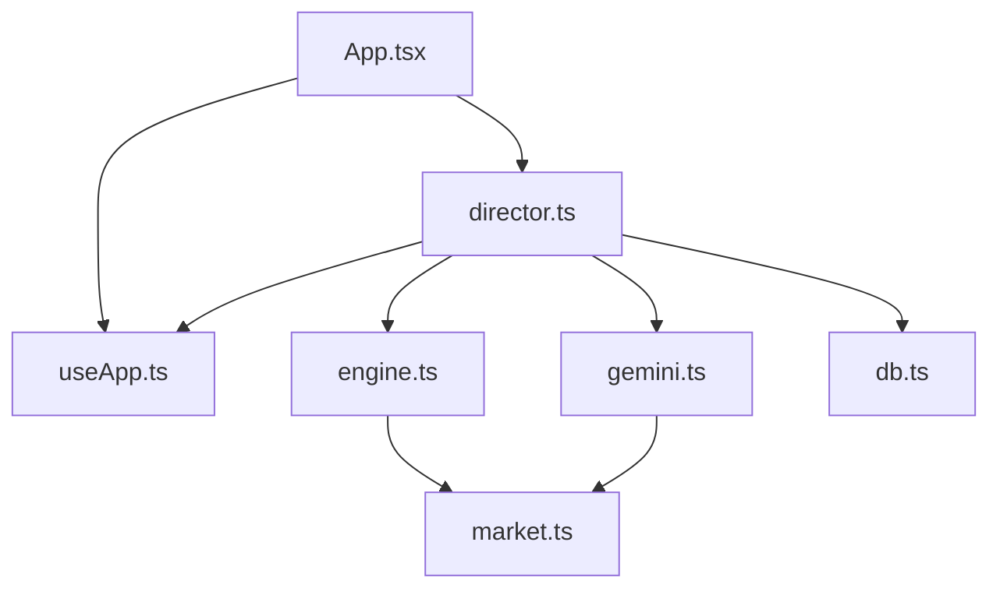
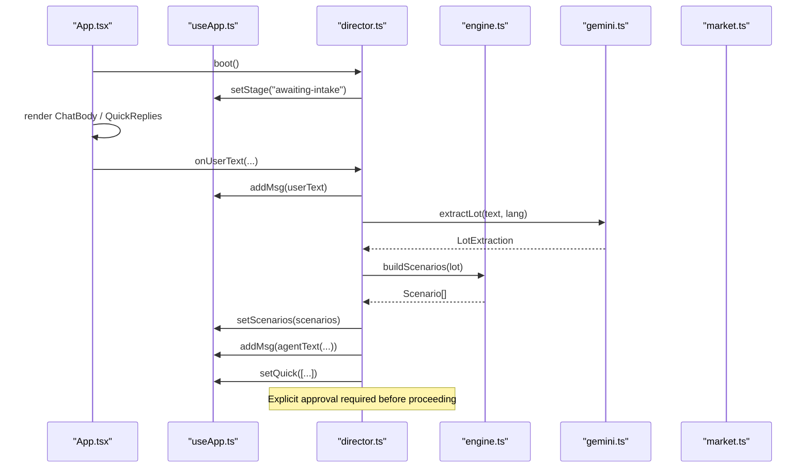
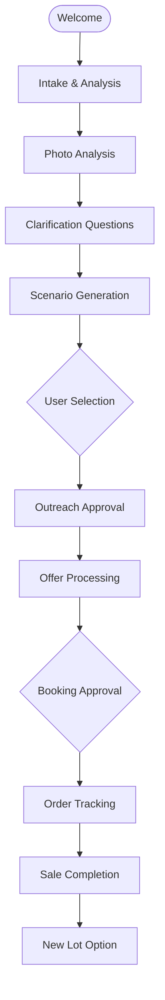
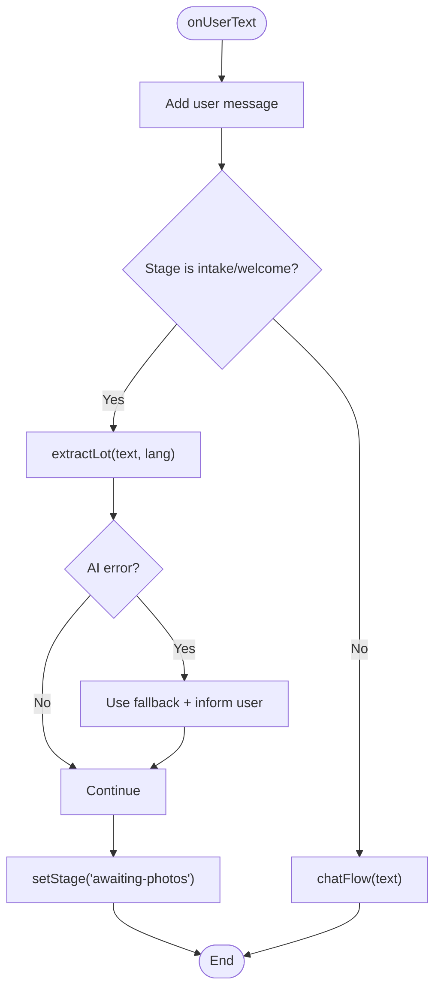
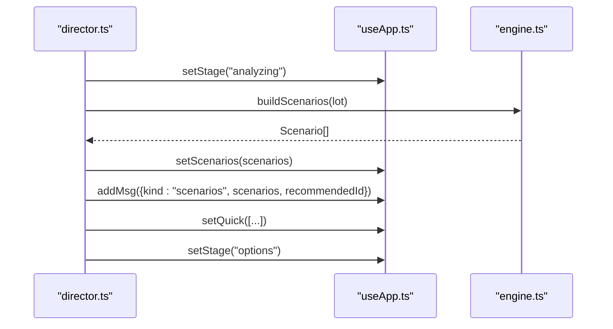
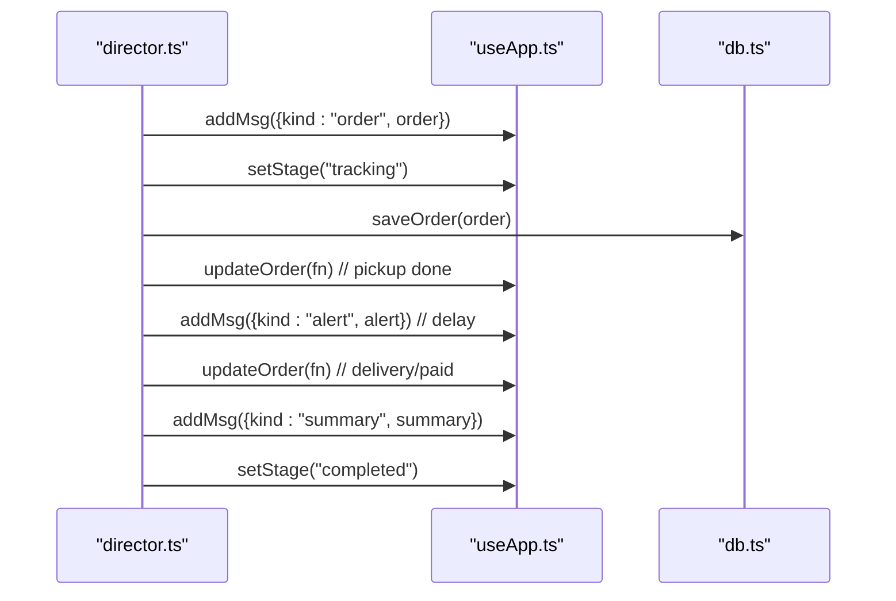
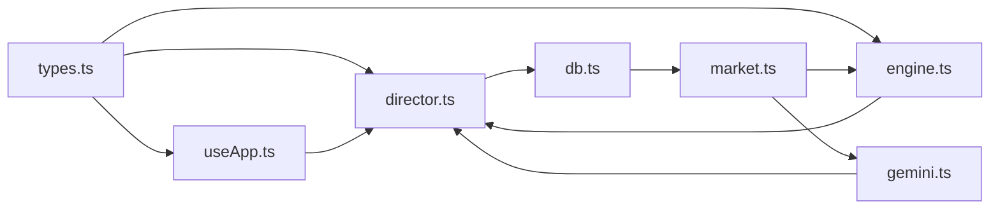

# State Management

<cite>
**Referenced Files in This Document**
- [useApp.ts](file://freshroute/src/store/useApp.ts)
- [director.ts](file://freshroute/src/store/director.ts)
- [types.ts](file://freshroute/src/types.ts)
- [engine.ts](file://freshroute/src/lib/engine.ts)
- [gemini.ts](file://freshroute/src/lib/gemini.ts)
- [market.ts](file://freshroute/src/data/market.ts)
- [App.tsx](file://freshroute/src/App.tsx)
- [package.json](file://freshroute/package.json)
</cite>

## Update Summary
**Changes Made**
- Enhanced director pattern implementation with comprehensive state machine for produce trading workflow
- Added sophisticated approval workflow system with explicit user consent at financial decision points
- Updated state management to support complete lifecycle from welcome to completion
- Enhanced scenario generation with advanced spoilage modeling and buyer matching
- Improved audit trail system for compliance and debugging

## Table of Contents
1. [Introduction](#introduction)
2. [Project Structure](#project-structure)
3. [Core Components](#core-components)
4. [Architecture Overview](#architecture-overview)
5. [Detailed Component Analysis](#detailed-component-analysis)
6. [Dependency Analysis](#dependency-analysis)
7. [Performance Considerations](#performance-considerations)
8. [Troubleshooting Guide](#troubleshooting-guide)
9. [Conclusion](#conclusion)

## Introduction
This document explains FreshRoute's enhanced Zustand-based state management system and sophisticated director pattern used to orchestrate the complete produce trading workflow. The system manages state across chat messages, lot information, scenarios, orders, and audit trails while ensuring explicit user approval at every financial decision point. It covers the main store shape, actions, reducers, type safety with TypeScript, subscription patterns, performance considerations, and debugging techniques for complex interactions.

## Project Structure
The state management is centered around a single Zustand store and a sophisticated director module that orchestrates multi-step workflows with explicit approval gates:
- Store definition and actions live in the store module with comprehensive state management
- The director implements a complete state machine managing the entire produce trading lifecycle
- Types define the domain model for messages, lots, scenarios, orders, audits, and UI states
- Supporting libraries provide market data, scenario engine logic, and AI integration via proxy

**Diagram sources**
- [App.tsx:1-37](file://freshroute/src/App.tsx#L1-L37)
- [useApp.ts:1-135](file://freshroute/src/store/useApp.ts#L1-L135)
- [director.ts:1-989](file://freshroute/src/store/director.ts#L1-L989)
- [engine.ts:1-294](file://freshroute/src/lib/engine.ts#L1-L294)
- [gemini.ts:1-200](file://freshroute/src/lib/gemini.ts#L1-L200)
- [market.ts:1-241](file://freshroute/src/data/market.ts#L1-L241)

**Section sources**
- [App.tsx:1-37](file://freshroute/src/App.tsx#L1-L37)
- [useApp.ts:1-135](file://freshroute/src/store/useApp.ts#L1-L135)
- [director.ts:1-989](file://freshroute/src/store/director.ts#L1-L989)
- [engine.ts:1-294](file://freshroute/src/lib/engine.ts#L1-L294)
- [gemini.ts:1-200](file://freshroute/src/lib/gemini.ts#L1-L200)
- [market.ts:1-241](file://freshroute/src/data/market.ts#L1-L241)

## Core Components
- **useApp store**: Centralized Zustand store holding application state and actions for messages, stages, lot details, scenarios, orders, audit logs, language, UI sheets, ticker prices, boot flag, AI mode/error, session, profile, and user roles.
- **Director**: Sophisticated workflow orchestrator implementing a state machine that transitions the app through stages with explicit user approval at every financial decision point, updates messages, sets quick replies, manages approvals, generates scenarios, creates orders, schedules tracking events, and surfaces alerts and summaries.
- **Types**: Strongly-typed interfaces for all domain entities and message variants ensuring compile-time safety across the app.

Key responsibilities:
- Message history and typing indicators drive UI feedback during async operations
- Lot intake and vision analysis produce structured lot objects with confidence metrics
- Scenario engine computes sale options with deductions, risk, and scoring using advanced spoilage modeling
- Approval requests gate outbound communications; outcomes update messages and audit trail
- Orders encapsulate buyer, transporter, pricing, and step-by-step tracking with real-time status updates
- Audit entries record every significant action by users, agent, or system for compliance and debugging

**Section sources**
- [useApp.ts:21-124](file://freshroute/src/store/useApp.ts#L21-L124)
- [director.ts:92-989](file://freshroute/src/store/director.ts#L92-L989)
- [types.ts:1-315](file://freshroute/src/types.ts#L1-L315)

## Architecture Overview
The architecture separates concerns between state storage (Zustand), workflow orchestration (director), business logic (engine), and external integrations (AI via gemini proxy). The app component initializes the flow on mount and renders UI pieces bound to store slices. The director implements a comprehensive state machine with explicit approval gates at critical financial decision points.

**Diagram sources**
- [App.tsx:14-32](file://freshroute/src/App.tsx#L14-L32)
- [useApp.ts:60-124](file://freshroute/src/store/useApp.ts#L60-L124)
- [director.ts:92-165](file://freshroute/src/store/director.ts#L92-L165)
- [engine.ts:72-272](file://freshroute/src/lib/engine.ts#L72-L272)
- [gemini.ts:91-116](file://freshroute/src/lib/gemini.ts#L91-L116)
- [market.ts:14-24](file://freshroute/src/data/market.ts#L14-L24)

## Detailed Component Analysis

### Enhanced Zustand Store: useApp
**Updated** Enhanced with comprehensive state management including user roles, improved approval handling, and better order management.

- **State fields** include stage, messages, typing flags, quick replies, lot, scenarios, audit log, language, sheet visibility, drawer state, ticker prices, boot flag, AI mode/error, session, profile, and user roles
- **Actions** provide immutable updates with enhanced functionality:
  - Message management: append user/agent text, voice, photos with proper typing indicators
  - Stage transitions: comprehensive workflow from welcome through completed with approval gates
  - Typing indicator control with optional label for better UX
  - Quick reply list updates for guided user interaction
  - Lot and scenarios setters with validation
  - Audit entry creation with actor, action, and approval flag for compliance
  - Approval request status updates with decision timestamp and audit trail
  - Order mutation helper to find and update the latest order message efficiently
  - Boot guard to prevent re-initialization
  - AI mode and error state updates with fallback handling
  - Auth session and profile updates with role management

Subscription patterns:
- Components subscribe to specific slices (e.g., sheet) to minimize re-renders
- The app boots once and triggers the director workflow with proper initialization

Best practices:
- Keep actions small and focused; compose larger workflows in the director
- Use functional updates where dependent on previous state (e.g., updateOrder)
- Prefer adding new message kinds via types union rather than ad-hoc shapes
- Maintain audit trail for all significant state changes

**Section sources**
- [useApp.ts:21-124](file://freshroute/src/store/useApp.ts#L21-L124)
- [App.tsx:14-32](file://freshroute/src/App.tsx#L14-L32)

### Sophisticated Director Pattern: Complete Workflow Orchestration
**Updated** Implemented comprehensive state machine managing entire produce trading workflow with explicit user approval at every financial decision point.

The director implements a complete state machine-like flow using explicit functions per phase with approval gates:

**Workflow Phases:**
- **Boot**: initialize session, greet user, present quick replies, set stage
- **Intake**: parse user input, extract lot info, show prices, prompt for photos
- **Photos/Vision**: analyze images, construct lot with vision results and confidence, confirm details
- **Clarify**: gather packaging/storage/departure preferences, generate scenarios
- **Options**: present recommended scenario, allow numbers/why explanations
- **Outreach Approval**: draft message, await user approval, send notice/offers
- **Offers**: compute transport costs, platform fees, expected net, present options
- **Final Approval**: create order, schedule tracking steps, surface alerts
- **Tracking**: simulate pickup, delays, delivery, payment, then summary
- **Completion**: finalize sale, offer new lot

**Approval Gates:**
- Explicit user approval required before sending any buyer communications
- Final booking approval required before creating orders
- All financial decisions require explicit user consent
- Comprehensive audit trail for all approval decisions

Error handling:
- AI errors are captured and surfaced once per step, falling back to offline demo data when needed
- Audit entries record failures and fallbacks for traceability
- Rate limiting prevents abuse while maintaining user experience

Extensibility:
- Add new phases by introducing new stage values and handler functions
- Extend message types to support richer UI components
- Integrate additional transporters/buyers via market data
- Support multiple approval workflows for different transaction types

**Section sources**
- [director.ts:92-989](file://freshroute/src/store/director.ts#L92-L989)

### Type System Integration
**Updated** Enhanced with comprehensive type definitions supporting the complete workflow lifecycle.

- All domain entities are strongly typed: Lot, VisionResult, Scenario, Order, Msg union, AuditEntry, Stage, QuickReply, UserRole, Profile, etc.
- Message union enforces correct payloads per kind (text, voice, photos, lot, clarify, scenarios, approval, offers, order, alert, summary)
- Stage enum constrains workflow transitions with comprehensive state machine support
- Types ensure compiler checks for props and state updates across components and director logic
- Enhanced role-based access control types for multi-user scenarios

Benefits:
- Catches mismatches at compile time (e.g., wrong message kind payload)
- Improves IDE autocomplete and documentation
- Reduces runtime errors in complex flows
- Supports role-based permissions and access control
- Ensures data consistency across the entire application

**Section sources**
- [types.ts:1-315](file://freshroute/src/types.ts#L1-L315)

### Example Workflows and State Updates

#### Complete Produce Trading Workflow
**Updated** Shows the full lifecycle from initial contact to completed sale with approval gates.

**Diagram sources**
- [director.ts:92-989](file://freshroute/src/store/director.ts#L92-L989)

#### Intake Flow with AI Integration
- User sends text → director adds user message → sets stage to analyzing → extracts lot → shows prices → prompts for photos → sets stage awaiting-photos
- If unsupported crop, suggests demo lot and returns to awaiting-intake
- AI integration with fallback mechanisms for reliability

**Diagram sources**
- [director.ts:167-192](file://freshroute/src/store/director.ts#L167-L192)
- [director.ts:121-165](file://freshroute/src/store/director.ts#L121-L165)
- [gemini.ts:91-116](file://freshroute/src/lib/gemini.ts#L91-L116)

#### Advanced Scenario Generation
- After clarifying packaging/storage/departure, director builds scenarios using engine with advanced spoilage modeling, sets scenarios, posts scenario message, and presents quick replies
- Includes local mandi, direct buyers, cold storage, and premium buyer options
- Real-time price calculations with transport cost optimization

**Diagram sources**
- [director.ts:333-373](file://freshroute/src/store/director.ts#L333-L373)
- [engine.ts:72-272](file://freshroute/src/lib/engine.ts#L72-L272)

#### Order Creation with Approval Workflow
- On final approval, director creates order message, sets stage to tracking, and schedules timed updates for pickup, delay alerts, completion, and summary
- Explicit user approval required before booking
- Real-time tracking with automated status updates

**Diagram sources**
- [director.ts:543-778](file://freshroute/src/store/director.ts#L543-L778)

### Best Practices for Extending the State Management System
**Updated** Enhanced guidelines for the sophisticated director pattern and approval workflows.

- Add new message kinds by extending the Msg union and corresponding UI rendering
- Introduce new stages only if they represent distinct workflow phases; keep transitions explicit in the director
- Encapsulate side effects in director functions; keep store actions pure and minimal
- Use audit entries to log important decisions and errors for debugging and compliance
- Leverage functional updates in actions like updateOrder to avoid stale closures
- Implement approval gates for all financial transactions requiring user consent
- Add rate limiting for API calls and user actions to prevent abuse
- Support multiple languages and cultural contexts in user interactions
- Ensure robust error handling with fallback mechanisms for AI services

## Dependency Analysis
**Updated** Enhanced dependency relationships reflecting the sophisticated director pattern and approval workflows.

The store depends on types and utilities; the director depends on store, engine, gemini, and database; engine depends on market data; gemini depends on market aliases and supabase proxy.

**Diagram sources**
- [types.ts:1-315](file://freshroute/src/types.ts#L1-L315)
- [useApp.ts:1-135](file://freshroute/src/store/useApp.ts#L1-L135)
- [director.ts:1-989](file://freshroute/src/store/director.ts#L1-L989)
- [engine.ts:1-294](file://freshroute/src/lib/engine.ts#L1-L294)
- [gemini.ts:1-200](file://freshroute/src/lib/gemini.ts#L1-L200)
- [market.ts:1-241](file://freshroute/src/data/market.ts#L1-L241)

**Section sources**
- [useApp.ts:1-135](file://freshroute/src/store/useApp.ts#L1-L135)
- [director.ts:1-989](file://freshroute/src/store/director.ts#L1-L989)
- [engine.ts:1-294](file://freshroute/src/lib/engine.ts#L1-L294)
- [gemini.ts:1-200](file://freshroute/src/lib/gemini.ts#L1-L200)
- [market.ts:1-241](file://freshroute/src/data/market.ts#L1-L241)

## Performance Considerations
**Updated** Enhanced performance considerations for the sophisticated state management system.

- **Minimal subscriptions**: Components subscribe to only the slices they need (e.g., sheet) to reduce re-renders
- **Batched updates**: Director sequences multiple store updates within async flows; consider grouping related updates where possible
- **Avoid large object copies**: Use functional updates (e.g., updateOrder) to mutate nested structures efficiently
- **Debounced computations**: Scenario generation and AI calls are already asynchronous; ensure UI remains responsive by showing typing indicators and quick replies
- **Ticker data**: Prices are generated once per crop; avoid recomputing unnecessarily
- **Rate limiting**: Built-in rate limiting prevents excessive API calls and maintains system stability
- **Memory management**: Proper cleanup of timers and event listeners in tracking workflows
- **Lazy loading**: Load heavy computations only when needed to improve initial load performance

## Troubleshooting Guide
**Updated** Enhanced troubleshooting guide for the sophisticated director pattern and approval workflows.

Common issues and debugging techniques:
- **AI proxy failures**: Errors are captured and surfaced once per step; check aiMode and aiError in store to diagnose connectivity or configuration problems
- **Fallback behavior**: When AI fails, deterministic fallbacks are used; audit entries indicate fallback usage
- **Stage mismatches**: Ensure stage transitions occur in correct order; director guards against invalid transitions
- **Message inconsistencies**: Validate message kinds and payloads using TypeScript; inspect msg.kind to debug rendering issues
- **Audit trail**: Review audit entries to trace user actions, agent responses, and system events
- **Approval workflow issues**: Check approval status and timestamps in audit trail for compliance verification
- **Rate limiting**: Monitor rate limit violations and adjust thresholds as needed

Practical steps:
- Inspect store state in React DevTools to verify stage, msgs, lot, scenarios, and audit arrays
- Log key transitions in director functions to map flow progression
- Use consumeAiError to retrieve and handle the last AI error in the UI
- Review audit trail for compliance and debugging purposes
- Monitor rate limiting statistics to optimize user experience

**Section sources**
- [director.ts:68-80](file://freshroute/src/store/director.ts#L68-L80)
- [gemini.ts:18-24](file://freshroute/src/lib/gemini.ts#L18-L24)
- [useApp.ts:116-124](file://freshroute/src/store/useApp.ts#L116-L124)

## Conclusion
FreshRoute's enhanced state management combines a sophisticated Zustand store with a comprehensive director pattern to manage the complete produce trading workflow. The system ensures explicit user approval at every financial decision point while maintaining performance and reliability. Strong TypeScript types ensure safety across messages, lots, scenarios, orders, and audits. The design supports extensibility, clear state transitions, comprehensive auditing, and robust error handling. By following best practices—minimal subscriptions, functional updates, thorough logging, and proper approval workflows—you can maintain performance and reliability as the application evolves to handle more complex trading scenarios.