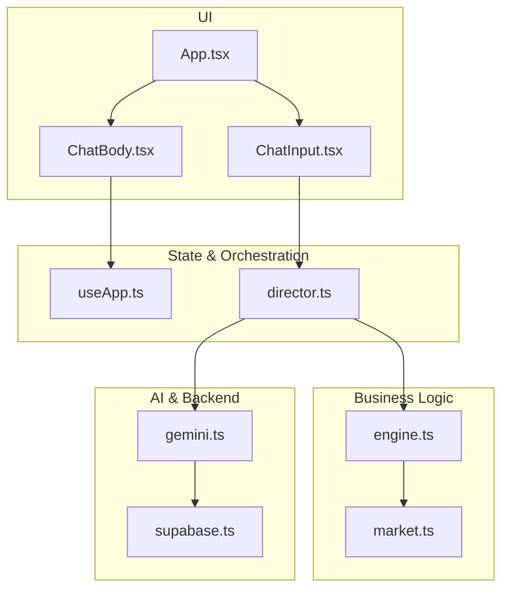
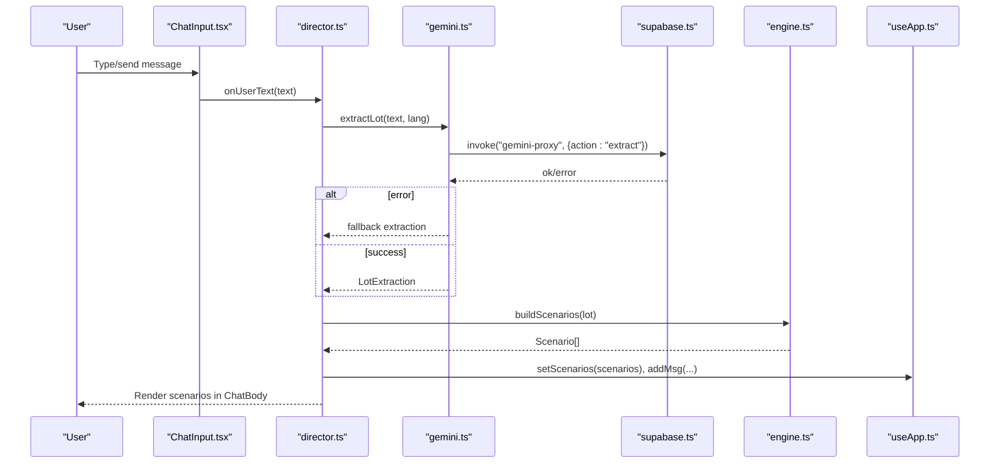
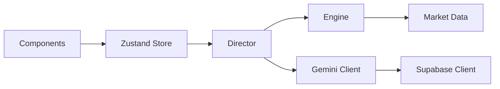

# Testing Strategy

<cite>
**Referenced Files in This Document**
- [package.json](file://freshroute/package.json)
- [vite.config.ts](file://freshroute/vite.config.ts)
- [App.tsx](file://freshroute/src/App.tsx)
- [ChatBody.tsx](file://freshroute/src/components/ChatBody.tsx)
- [ChatInput.tsx](file://freshroute/src/components/ChatInput.tsx)
- [engine.ts](file://freshroute/src/lib/engine.ts)
- [gemini.ts](file://freshroute/src/lib/gemini.ts)
- [supabase.ts](file://freshroute/src/lib/supabase.ts)
- [market.ts](file://freshroute/src/data/market.ts)
- [useApp.ts](file://freshroute/src/store/useApp.ts)
- [director.ts](file://freshroute/src/store/director.ts)
- [types.ts](file://freshroute/src/types.ts)
</cite>

## Table of Contents
1. Introduction
2. Project Structure
3. Core Components
4. Architecture Overview
5. Detailed Component Analysis
6. Dependency Analysis
7. Performance Considerations
8. Troubleshooting Guide
9. Conclusion
10. Appendices

## Introduction
This document defines a comprehensive testing strategy for FreshRoute, covering unit tests, integration tests, and end-to-end (E2E) tests. It focuses on:
- React components that render chat flows, cards, and inputs
- Business logic in the engine module for scenario generation and transport options
- State management in the Zustand store
- AI integration layers via Supabase Edge Functions and Google Gemini
- Test organization patterns, mocking strategies, coverage targets, and CI setup

The goal is to ensure correctness of pricing and logistics calculations, robustness under AI failures, reliable UI interactions, and stable automated pipelines.

## Project Structure
FreshRoute is a React + TypeScript Vite application with:
- src/components: UI components for chat, cards, and sheets
- src/lib: Engine, Gemini client, Supabase client, utilities
- src/store: Zustand store and director orchestration
- src/data: Market data (prices, buyers, transporters, distances)
- src/types: Shared types for messages, orders, scenarios, etc.

**Diagram sources**
- [App.tsx:14-33](file://freshroute/src/App.tsx#L14-L33)
- [ChatBody.tsx:32-84](file://freshroute/src/components/ChatBody.tsx#L32-L84)
- [ChatInput.tsx:7-86](file://freshroute/src/components/ChatInput.tsx#L7-L86)
- [useApp.ts:56-118](file://freshroute/src/store/useApp.ts#L56-L118)
- [director.ts:86-106](file://freshroute/src/store/director.ts#L86-L106)
- [engine.ts:47-235](file://freshroute/src/lib/engine.ts#L47-L235)
- [market.ts:13-189](file://freshroute/src/data/market.ts#L13-L189)
- [gemini.ts:28-42](file://freshroute/src/lib/gemini.ts#L28-L42)
- [supabase.ts:1-20](file://freshroute/src/lib/supabase.ts#L1-L20)

**Section sources**
- [package.json:1-38](file://freshroute/package.json#L1-L38)
- [vite.config.ts:1-13](file://freshroute/vite.config.ts#L1-L13)

## Core Components
Key areas to test:
- Engine: deterministic business rules for scenario building, scoring, and transport options
- Store: state transitions, message handling, approvals, order updates
- AI layer: proxy calls to Supabase Edge Function for Gemini; fallbacks when unavailable
- UI: rendering of messages, cards, input behavior, and user interactions

Testing priorities:
- Engine math and edge cases (grades, packaging, spoilage, transport costs)
- Store actions and derived state (messages, audit entries, stages)
- AI integration resilience (errors, fallbacks, demo mode)
- UI interactions (send text, voice note simulation, photo upload flow)

**Section sources**
- [engine.ts:17-258](file://freshroute/src/lib/engine.ts#L17-L258)
- [useApp.ts:20-129](file://freshroute/src/store/useApp.ts#L20-L129)
- [gemini.ts:28-200](file://freshroute/src/lib/gemini.ts#L28-L200)
- [ChatBody.tsx:32-84](file://freshroute/src/components/ChatBody.tsx#L32-L84)
- [ChatInput.tsx:7-86](file://freshroute/src/components/ChatInput.tsx#L7-L86)

## Architecture Overview
The app orchestrates a conversation-driven workflow:
- User interacts via ChatInput or quick replies
- Director manages stages, invokes AI extraction and vision, builds scenarios, handles approvals, and tracks orders
- Engine computes scenarios using market data and business rules
- Gemini client proxies requests to Supabase Edge Function; falls back to offline/demo modes on failure
- Store holds UI state and messages; components read from it

**Diagram sources**
- [ChatInput.tsx:13-18](file://freshroute/src/components/ChatInput.tsx#L13-L18)
- [director.ts:145-156](file://freshroute/src/store/director.ts#L145-L156)
- [gemini.ts:91-116](file://freshroute/src/lib/gemini.ts#L91-L116)
- [supabase.ts:28-34](file://freshroute/src/lib/supabase.ts#L28-L34)
- [engine.ts:47-235](file://freshroute/src/lib/engine.ts#L47-L235)
- [useApp.ts:75-80](file://freshroute/src/store/useApp.ts#L75-L80)

## Detailed Component Analysis

### Unit Testing: Engine Module
Focus areas:
- gradePriceFactor for A/B/C grades
- spoilagePct based on crop volatility, packaging, ripeness, refrigeration
- buildScenarios for local mandi, direct buyers, cold storage, premium buyer
- transportOptions cost and recommendations

Test guidelines:
- Validate net calculations across scenarios
- Verify recommended scenario selection by score
- Ensure deductions include platform fee, loading, transport, mandi commission, cold storage where applicable
- Confirm risk labels and why explanations are consistent with inputs

Example test cases:
- Local mandi sale: verify gross = price × acceptedKg; deductions include mandi commission and cartage; net computed correctly
- Direct buyer: compute distance-based transport cost; apply grade factor; include platform fee and loading; expected net matches formula
- Cold storage: include per-kg-per-day storage cost; adjust spoilage; confirm net vs direct buyer
- Premium buyer: refrigerated transport cost; higher price with premium percentage; rejection impact on acceptedKg
- Transport options: cost proportional to distance; recommended flag logic; eta string format

Coverage targets:
- Branch coverage for grade factors, packaging, refrigeration flags
- All scenario branches (local, direct, store, premium)
- transportOptions mapping

**Section sources**
- [engine.ts:17-258](file://freshroute/src/lib/engine.ts#L17-L258)
- [market.ts:13-189](file://freshroute/src/data/market.ts#L13-L189)

### Unit Testing: Store (Zustand)
Focus areas:
- Message creation helpers (agentText, userText)
- Stage transitions and quick replies
- Approval updates and order updates
- Audit logging

Test guidelines:
- Assert state changes after calling setters
- Verify messages array grows with correct kind and role
- Ensure updateOrder mutates last order message only
- Confirm audit entries appended with actor and action

Example test cases:
- addMsg pushes new message with uid and timestamp
- setStage updates stage and clears quick replies appropriately
- updateApproval toggles status and sets decidedAt
- updateOrder applies function to last order message

Coverage targets:
- All setter functions
- Conditional branches in updateApproval and updateOrder

**Section sources**
- [useApp.ts:20-129](file://freshroute/src/store/useApp.ts#L20-L129)

### Integration Testing: AI Layer (Gemini + Supabase)
Focus areas:
- Proxy invocation via supabase.functions.invoke
- Error handling and fallbacks
- Demo/offline mode behavior
- Vision analysis fallbacks

Test guidelines:
- Mock supabase.functions.invoke to return ok/error payloads
- Validate extractLot returns fallback when proxy fails or malformed JSON
- Validate analyzePhoto returns demo VisionResult when image data invalid or proxy error
- Check consumeAiError surfaces last error once

Example test cases:
- extractLot with successful proxy: returns gemini source with normalized fields
- extractLot with network error: returns fallback with confidence defaults
- analyzePhoto with missing data: returns demo result and sets aiError
- agentChat with error: returns fallback response based on last user text

**Section sources**
- [gemini.ts:28-200](file://freshroute/src/lib/gemini.ts#L28-L200)
- [supabase.ts:1-20](file://freshroute/src/lib/supabase.ts#L1-L20)

### Integration Testing: Director Orchestration
Focus areas:
- End-to-end flow from intake to scenarios to approval to order
- AI error surfacing and fallback messaging
- Stage progression and quick reply routing

Test guidelines:
- Use a test harness to call director functions directly
- Mock AI layer to control responses
- Assert store state transitions and messages at each step
- Validate audit entries for key actions

Example test cases:
- Boot sequence: initial messages and quick replies appear
- Intake flow: extractLot called; if unsupported crop, prompt demo lot
- Photos chosen: analyzePhoto invoked; lot created with vision; clarify card shown
- Clarify confirmed: buildScenarios called; scenarios rendered; recommendation announced
- Proceed with option: approval request drafted; user approves; offers flow runs
- Approve final: order created; tracking steps scheduled; summary emitted

**Section sources**
- [director.ts:86-750](file://freshroute/src/store/director.ts#L86-L750)
- [useApp.ts:56-118](file://freshroute/src/store/useApp.ts#L56-L118)

### UI Testing: React Components
Focus areas:
- ChatBody renders different message kinds correctly
- ChatInput sends text and simulates voice note recording
- Quick replies trigger appropriate handlers

Test guidelines:
- Render components with mocked store state
- Simulate user interactions (typing, clicking send, opening photos sheet)
- Assert DOM output and side effects (store updates via director)

Example test cases:
- ChatBody renders AgentBubble for agent text and TextUser for user text
- Typing bubble appears when typing is true
- ChatInput send triggers onUserText with trimmed value
- Voice note button toggles recording state and calls onVoiceNote

**Section sources**
- [ChatBody.tsx:32-84](file://freshroute/src/components/ChatBody.tsx#L32-L84)
- [ChatInput.tsx:7-86](file://freshroute/src/components/ChatInput.tsx#L7-L86)

### End-to-End Testing: Critical Workflows
Recommended approach:
- Use Playwright or Cypress to drive browser interactions
- Seed environment variables for Supabase placeholder mode
- Mock Edge Function responses via network interception or server-side mocks

Critical workflows to automate:
- Crop analysis: type lot description → AI extraction → photo analysis → scenario generation
- Market calculations: view prices, compare scenarios, show numbers breakdown
- Order processing: approve outreach → select transporter → confirm order → track steps → completion summary

Automation tips:
- Stabilize selectors around message bubbles and cards
- Intercept AI proxy calls to avoid flaky external dependencies
- Assert key outcomes: recommended scenario, order ID presence, tracking steps

[No sources needed since this section provides general guidance]

## Dependency Analysis
External dependencies relevant to testing:
- @supabase/supabase-js: used for Edge Function invocation
- @google/genai: proxied through Supabase; not directly imported in frontend code
- zustand: state management
- react/react-dom: UI framework

Mocking strategy:
- supabase.functions.invoke: mock to return ok/error payloads
- window.fetch: intercept for urlToDataUrl conversion in director
- Date.now(): stub for deterministic timestamps in tests

**Diagram sources**
- [useApp.ts:1-129](file://freshroute/src/store/useApp.ts#L1-L129)
- [director.ts:1-750](file://freshroute/src/store/director.ts#L1-L750)
- [engine.ts:1-258](file://freshroute/src/lib/engine.ts#L1-L258)
- [gemini.ts:1-200](file://freshroute/src/lib/gemini.ts#L1-L200)
- [supabase.ts:1-20](file://freshroute/src/lib/supabase.ts#L1-L20)
- [market.ts:1-189](file://freshroute/src/data/market.ts#L1-L189)

**Section sources**
- [package.json:12-23](file://freshroute/package.json#L12-L23)

## Performance Considerations
- Keep unit tests fast and deterministic; avoid real network calls
- Mock AI proxy to reduce flakiness and speed up CI
- Batch assertions on store snapshots for complex flows
- Use lightweight fixtures for market data and scenarios
- Avoid heavy image processing in tests; use small base64 strings or mocks

[No sources needed since this section provides general guidance]

## Troubleshooting Guide
Common issues and resolutions:
- AI proxy unreachable: tests should assert fallback behavior and aiError consumption
- Malformed AI responses: validate try/catch paths returning demo results
- Environment variables missing: ensure placeholders are used; backendConfigured false disables live features
- Time-sensitive tests: stub Date.now() and timers for predictable outputs

Verification steps:
- Run engine tests with varied inputs to cover all branches
- Simulate AI errors and confirm fallback messages appear in chat
- Assert audit entries for failed AI steps

**Section sources**
- [gemini.ts:28-200](file://freshroute/src/lib/gemini.ts#L28-L200)
- [supabase.ts:1-20](file://freshroute/src/lib/supabase.ts#L1-L20)
- [director.ts:62-74](file://freshroute/src/store/director.ts#L62-L74)

## Conclusion
A robust testing strategy for FreshRoute combines:
- Deterministic unit tests for engine math and store actions
- Integration tests validating AI fallbacks and director orchestration
- E2E tests automating critical workflows with mocked external services
- Clear coverage targets and CI automation to maintain quality

Adopting these practices ensures reliability of pricing, logistics, and user experience while keeping tests fast and maintainable.

[No sources needed since this section summarizes without analyzing specific files]

## Appendices

### Test Organization Patterns
- Place unit tests next to source files (e.g., engine.test.ts, useApp.test.ts)
- Group integration tests by feature (e.g., director.integration.test.ts)
- E2E tests under an e2e directory with page objects for reusable interactions

### Coverage Requirements
- Aim for ≥80% statement and branch coverage on core modules (engine, store, gemini)
- Enforce 100% coverage on pure functions (gradePriceFactor, spoilagePct, transportOptions)
- Track uncovered branches related to AI fallbacks and error paths

### Continuous Integration Setup
- Install dev dependencies including testing libraries (e.g., Vitest/Jest, React Testing Library, Playwright)
- Add scripts for running tests and generating coverage reports
- Configure CI to run lint, type checks, unit/integration tests, and E2E suites
- Cache node_modules and browser binaries to speed up pipelines

[No sources needed since this section provides general guidance]