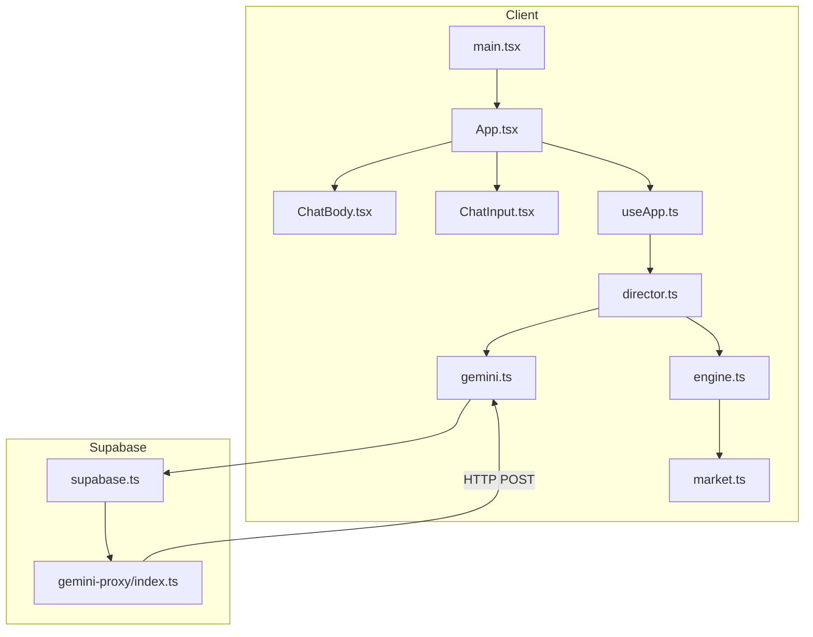
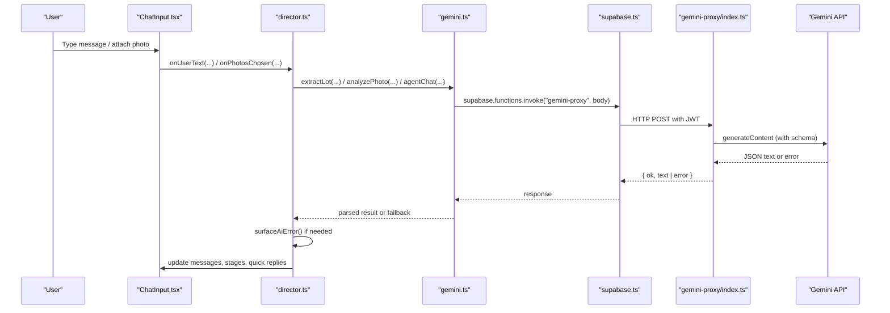
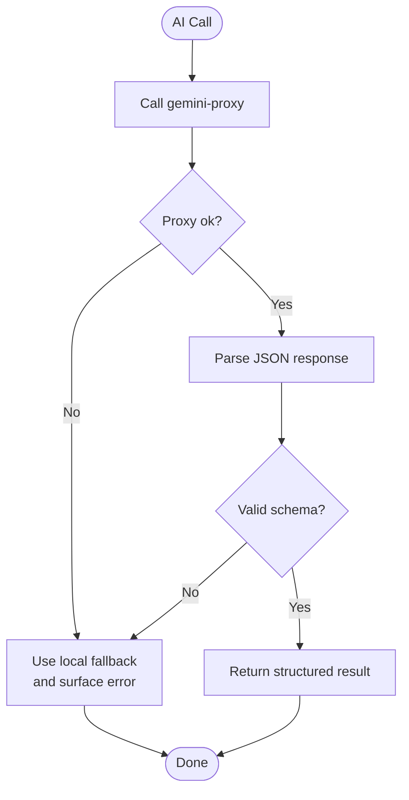
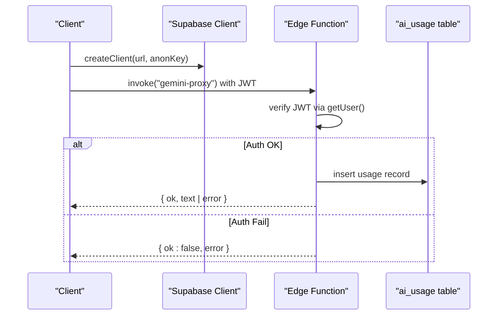
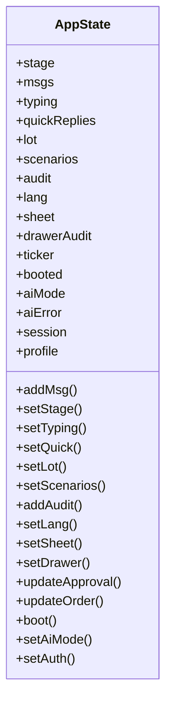
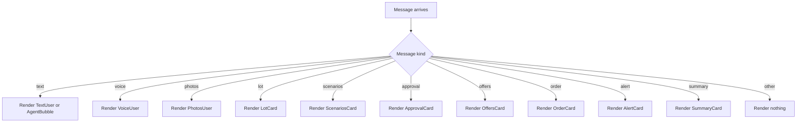
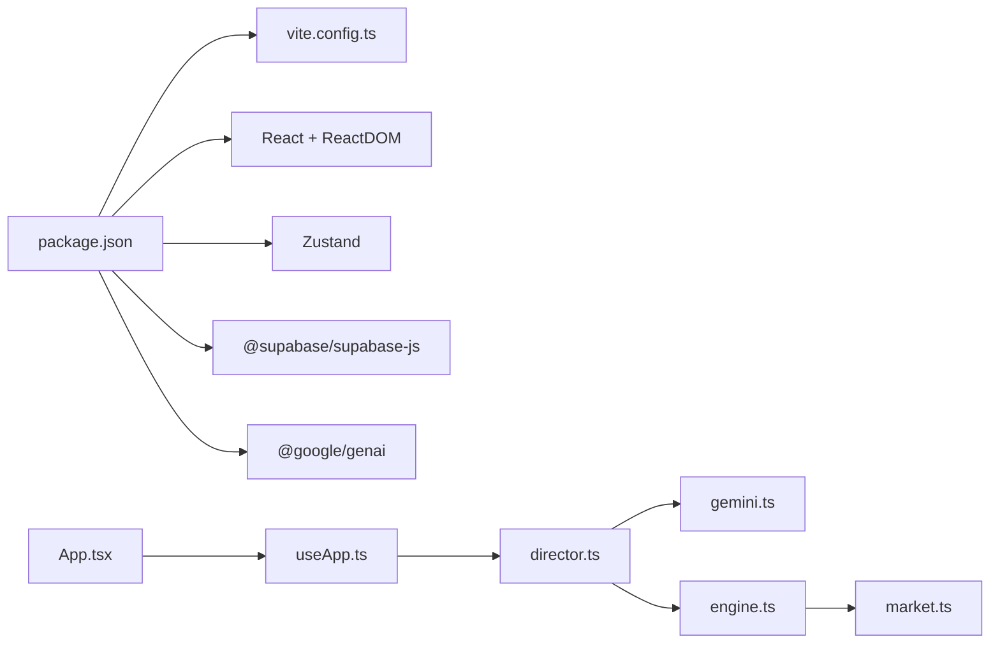

# Troubleshooting & FAQ

<cite>
**Referenced Files in This Document**
- [package.json](file://freshroute/package.json)
- [README.md](file://freshroute/README.md)
- [vite.config.ts](file://freshroute/vite.config.ts)
- [main.tsx](file://freshroute/src/main.tsx)
- [App.tsx](file://freshroute/src/App.tsx)
- [supabase.ts](file://freshroute/src/lib/supabase.ts)
- [gemini.ts](file://freshroute/src/lib/gemini.ts)
- [engine.ts](file://freshroute/src/lib/engine.ts)
- [market.ts](file://freshroute/src/data/market.ts)
- [useApp.ts](file://freshroute/src/store/useApp.ts)
- [director.ts](file://freshroute/src/store/director.ts)
- [types.ts](file://freshroute/src/types.ts)
- [ChatBody.tsx](file://freshroute/src/components/ChatBody.tsx)
- [ChatInput.tsx](file://freshroute/src/components/ChatInput.tsx)
- [index.ts](file://freshroute/supabase/functions/gemini-proxy/index.ts)
</cite>

## Table of Contents
1. Introduction
2. Project Structure
3. Core Components
4. Architecture Overview
5. Detailed Component Analysis
6. Dependency Analysis
7. Performance Considerations
8. Troubleshooting Guide
9. Conclusion
10. Appendices

## Introduction
This document provides comprehensive troubleshooting and FAQs for FreshRoute, focusing on common issues such as AI service connectivity problems, Supabase authentication errors, build failures, runtime exceptions, state management debugging, component rendering problems, API integration failures, performance bottlenecks, logging strategies, error reporting mechanisms, and recommended debugging tools. It is designed to be accessible to users with limited technical knowledge while providing precise guidance tied to the codebase.

## Project Structure
FreshRoute is a React + TypeScript + Vite application that integrates:
- A client-side chat UI driven by Zustand state
- An AI proxy via Supabase Edge Functions (Gemini)
- Local business logic for scenario generation and transport pricing
- Market data and types for consistent modeling

**Diagram sources**
- [main.tsx:1-11](file://freshroute/src/main.tsx#L1-L11)
- [App.tsx:1-37](file://freshroute/src/App.tsx#L1-L37)
- [ChatBody.tsx:1-85](file://freshroute/src/components/ChatBody.tsx#L1-L85)
- [ChatInput.tsx:1-87](file://freshroute/src/components/ChatInput.tsx#L1-L87)
- [useApp.ts:1-129](file://freshroute/src/store/useApp.ts#L1-L129)
- [director.ts:1-750](file://freshroute/src/store/director.ts#L1-L750)
- [gemini.ts:1-200](file://freshroute/src/lib/gemini.ts#L1-L200)
- [engine.ts:1-258](file://freshroute/src/lib/engine.ts#L1-L258)
- [market.ts:1-189](file://freshroute/src/data/market.ts#L1-L189)
- [supabase.ts:1-20](file://freshroute/src/lib/supabase.ts#L1-L20)
- [index.ts:1-282](file://freshroute/supabase/functions/gemini-proxy/index.ts#L1-L282)

**Section sources**
- [package.json:1-38](file://freshroute/package.json#L1-L38)
- [README.md:1-33](file://freshroute/README.md#L1-L33)
- [vite.config.ts:1-13](file://freshroute/vite.config.ts#L1-L13)

## Core Components
- Application bootstrap and routing: main entry renders App; App orchestrates UI panels and triggers boot sequence.
- State management: Zustand store holds messages, stage, lot, scenarios, audit log, language, sheets, and AI mode.
- Director flow: Orchestrates user interactions, AI calls, scenario generation, approvals, offers, orders, and tracking simulation.
- AI integration: Client calls Supabase functions to reach Gemini; includes fallbacks and error surfacing.
- Business engine: Generates sale scenarios, transport options, costs, spoilage estimates, and scoring.
- Data layer: Market prices, buyers, transporters, storage facilities, and utilities.

Key responsibilities and failure points are mapped below to guide diagnostics.

**Section sources**
- [main.tsx:1-11](file://freshroute/src/main.tsx#L1-L11)
- [App.tsx:1-37](file://freshroute/src/App.tsx#L1-L37)
- [useApp.ts:1-129](file://freshroute/src/store/useApp.ts#L1-L129)
- [director.ts:1-750](file://freshroute/src/store/director.ts#L1-L750)
- [gemini.ts:1-200](file://freshroute/src/lib/gemini.ts#L1-L200)
- [engine.ts:1-258](file://freshroute/src/lib/engine.ts#L1-L258)
- [market.ts:1-189](file://freshroute/src/data/market.ts#L1-L189)

## Architecture Overview
The app uses a layered architecture:
- UI Layer: React components render chat, cards, inputs, and modals.
- State Layer: Zustand store manages session state and UI flags.
- Flow Layer: Director coordinates flows and side effects.
- Integration Layer: Supabase client invokes Edge Functions; Edge Functions call Gemini.
- Domain Layer: Engine computes scenarios and transport options using market data.

**Diagram sources**
- [ChatInput.tsx:1-87](file://freshroute/src/components/ChatInput.tsx#L1-L87)
- [director.ts:110-156](file://freshroute/src/store/director.ts#L110-L156)
- [gemini.ts:28-42](file://freshroute/src/lib/gemini.ts#L28-L42)
- [supabase.ts:1-20](file://freshroute/src/lib/supabase.ts#L1-L20)
- [index.ts:61-140](file://freshroute/supabase/functions/gemini-proxy/index.ts#L61-L140)
- [index.ts:142-282](file://freshroute/supabase/functions/gemini-proxy/index.ts#L142-L282)

## Detailed Component Analysis

### AI Service Connectivity and Fallbacks
- The client routes all AI traffic through a Supabase Edge Function that validates the caller’s JWT and proxies requests to Gemini with strict schemas.
- Errors from the proxy are surfaced to the UI via a one-time error consumer and an audit entry, ensuring transparency when falling back to offline/demo behavior.
- Status checks determine whether live AI is available; otherwise demo mode is used.

**Diagram sources**
- [gemini.ts:28-42](file://freshroute/src/lib/gemini.ts#L28-L42)
- [gemini.ts:91-116](file://freshroute/src/lib/gemini.ts#L91-L116)
- [gemini.ts:131-161](file://freshroute/src/lib/gemini.ts#L131-L161)
- [gemini.ts:169-182](file://freshroute/src/lib/gemini.ts#L169-L182)
- [index.ts:30-59](file://freshroute/supabase/functions/gemini-proxy/index.ts#L30-L59)
- [index.ts:103-140](file://freshroute/supabase/functions/gemini-proxy/index.ts#L103-L140)

**Section sources**
- [gemini.ts:1-200](file://freshroute/src/lib/gemini.ts#L1-L200)
- [index.ts:1-282](file://freshroute/supabase/functions/gemini-proxy/index.ts#L1-L282)
- [director.ts:62-74](file://freshroute/src/store/director.ts#L62-L74)

### Supabase Authentication and Configuration
- The client creates a Supabase client using environment variables; a flag indicates whether credentials are configured.
- The Edge Function enforces JWT-based auth and logs usage to an ai_usage table via a service role client.
- Missing or invalid keys produce explicit error modes and fallback behavior.

**Diagram sources**
- [supabase.ts:1-20](file://freshroute/src/lib/supabase.ts#L1-L20)
- [index.ts:61-91](file://freshroute/supabase/functions/gemini-proxy/index.ts#L61-L91)
- [index.ts:87-101](file://freshroute/supabase/functions/gemini-proxy/index.ts#L87-L101)

**Section sources**
- [supabase.ts:1-20](file://freshroute/src/lib/supabase.ts#L1-L20)
- [index.ts:61-140](file://freshroute/supabase/functions/gemini-proxy/index.ts#L61-L140)

### Build and Dev Environment Issues
- Vite alias resolution uses @ pointing to src; ensure imports use @ paths consistently.
- Scripts include dev, build, lint, preview; type checking runs before build.
- Linting uses Oxlint; rules can be extended for stricter checks.

Common pitfalls:
- Import path mismatches causing module resolution errors.
- TypeScript compilation errors blocking builds.
- Missing environment variables at runtime affecting Supabase/Gemini integration.

**Section sources**
- [vite.config.ts:1-13](file://freshroute/vite.config.ts#L1-L13)
- [package.json:1-38](file://freshroute/package.json#L1-L38)
- [README.md:14-33](file://freshroute/README.md#L14-L33)

### State Management Debugging
- Zustand store exposes actions for adding messages, setting stages, updating approvals, orders, and toggling UI sheets.
- Director updates stage transitions and writes audit entries for traceability.
- Use the audit log and message history to reconstruct user journeys and identify where flows diverge.

**Diagram sources**
- [useApp.ts:20-118](file://freshroute/src/store/useApp.ts#L20-L118)

**Section sources**
- [useApp.ts:1-129](file://freshroute/src/store/useApp.ts#L1-L129)
- [director.ts:86-106](file://freshroute/src/store/director.ts#L86-L106)

### Component Rendering Problems
- ChatBody renders different message kinds via a switch; missing handlers return null.
- Typing indicator depends on typing state; ensure director sets typing flags around async work.
- Input handling sends text and simulates voice note recording; ensure events trigger correct handlers.

**Diagram sources**
- [ChatBody.tsx:46-79](file://freshroute/src/components/ChatBody.tsx#L46-L79)

**Section sources**
- [ChatBody.tsx:1-85](file://freshroute/src/components/ChatBody.tsx#L1-L85)
- [ChatInput.tsx:1-87](file://freshroute/src/components/ChatInput.tsx#L1-L87)

### API Integration Failures
- All AI calls go through the proxy; network errors, rate limits, and invalid keys are handled explicitly.
- The client parses responses and falls back to deterministic offline extraction or demo vision results when necessary.
- Audit entries and user-facing warnings help diagnose failures without silent degradation.

**Section sources**
- [gemini.ts:28-42](file://freshroute/src/lib/gemini.ts#L28-L42)
- [gemini.ts:91-116](file://freshroute/src/lib/gemini.ts#L91-L116)
- [gemini.ts:131-161](file://freshroute/src/lib/gemini.ts#L131-L161)
- [index.ts:30-59](file://freshroute/supabase/functions/gemini-proxy/index.ts#L30-L59)

## Dependency Analysis
- Client dependencies include React, Zustand, Supabase JS, Google GenAI SDK, Tailwind utilities, and Vite tooling.
- The app depends on:
  - Vite config for aliases and plugins
  - Store for state and side-effect orchestration
  - Library modules for AI, engine, formatting, and market data
  - Components for UI rendering

**Diagram sources**
- [package.json:12-35](file://freshroute/package.json#L12-L35)
- [vite.config.ts:1-13](file://freshroute/vite.config.ts#L1-L13)
- [App.tsx:1-37](file://freshroute/src/App.tsx#L1-L37)
- [useApp.ts:1-129](file://freshroute/src/store/useApp.ts#L1-L129)
- [director.ts:1-750](file://freshroute/src/store/director.ts#L1-L750)
- [gemini.ts:1-200](file://freshroute/src/lib/gemini.ts#L1-L200)
- [engine.ts:1-258](file://freshroute/src/lib/engine.ts#L1-L258)
- [market.ts:1-189](file://freshroute/src/data/market.ts#L1-L189)

**Section sources**
- [package.json:1-38](file://freshroute/package.json#L1-L38)
- [vite.config.ts:1-13](file://freshroute/vite.config.ts#L1-L13)

## Performance Considerations
- Slow AI responses:
  - Check network latency and rate limits; the proxy returns specific error messages for 429 and key issues.
  - Prefer smaller payloads; the proxy truncates history and text to reduce token usage.
  - Use status checks to avoid unnecessary calls when in demo mode.
- Memory leaks:
  - Avoid storing large base64 images longer than needed; convert and send promptly then discard references.
  - Ensure timers in tracking simulation do not persist beyond session lifecycle.
- Optimization opportunities:
  - Debounce rapid input changes; batch UI updates where possible.
  - Memoize expensive computations in components if message lists grow large.
  - Use streaming or incremental updates if future enhancements allow partial responses.

[No sources needed since this section provides general guidance]

## Troubleshooting Guide

### AI Service Connectivity Issues
Symptoms:
- “Could not reach the AI proxy” or “Gemini rejected the API key”.
- Repeated fallback messages indicating offline/demo mode.

Diagnostic steps:
- Verify Supabase project URL and anon key are set in environment variables.
- Confirm the Edge Function is deployed and secrets include GEMINI_API_KEY.
- Check browser console for fetch errors and network tab for 4xx/5xx responses.
- Inspect the ai_usage table for recent errors and latency metrics.

Resolution:
- Set or refresh GEMINI_API_KEY in Supabase secrets.
- Ensure CORS headers are allowed; the function permits standard headers.
- If rate-limited, retry after delay; consider reducing payload size.

**Section sources**
- [gemini.ts:28-42](file://freshroute/src/lib/gemini.ts#L28-L42)
- [index.ts:30-59](file://freshroute/supabase/functions/gemini-proxy/index.ts#L30-L59)
- [index.ts:103-140](file://freshroute/supabase/functions/gemini-proxy/index.ts#L103-L140)

### Supabase Authentication Errors
Symptoms:
- “Missing auth token”, “Invalid or expired session”.
- Unable to invoke functions or access protected resources.

Diagnostic steps:
- Confirm the user is signed in and the session is persisted.
- Validate that detectSessionInUrl is enabled for password reset links.
- Check that the Edge Function receives a valid Authorization header.

Resolution:
- Re-authenticate the user or refresh the session.
- Ensure environment variables point to the correct Supabase project.
- Review server logs in the Supabase dashboard for auth failures.

**Section sources**
- [supabase.ts:1-20](file://freshroute/src/lib/supabase.ts#L1-L20)
- [index.ts:61-91](file://freshroute/supabase/functions/gemini-proxy/index.ts#L61-L91)

### Build Failures
Symptoms:
- TypeScript errors during build.
- Module resolution errors for @ imports.
- Linting errors preventing deployment.

Diagnostic steps:
- Run the dev script to catch type errors early.
- Verify all imports use the @ alias consistently.
- Review Oxlint configuration and enable type-aware rules if desired.

Resolution:
- Fix type errors reported by the compiler.
- Align import paths with the configured alias.
- Adjust lint rules or fix violations.

**Section sources**
- [package.json:6-10](file://freshroute/package.json#L6-L10)
- [vite.config.ts:5-11](file://freshroute/vite.config.ts#L5-L11)
- [README.md:14-33](file://freshroute/README.md#L14-L33)

### Runtime Exceptions
Symptoms:
- Unexpected blank screens or missing cards.
- Messages not appearing or stuck in typing state.

Diagnostic steps:
- Open the browser console for unhandled exceptions.
- Inspect Zustand state via devtools to verify stage and messages.
- Check that director sets typing flags correctly around async operations.

Resolution:
- Add guards for undefined or malformed data before rendering.
- Ensure all message kinds have corresponding render branches.
- Reset state or re-run boot if session initialization fails.

**Section sources**
- [ChatBody.tsx:46-79](file://freshroute/src/components/ChatBody.tsx#L46-L79)
- [director.ts:26-32](file://freshroute/src/store/director.ts#L26-L32)

### State Management Issues
Symptoms:
- Incorrect stage transitions or stale messages.
- Approvals/orders not updating as expected.

Diagnostic steps:
- Inspect the audit log for actor and action timestamps.
- Trace state changes in the store actions.
- Verify that quick replies trigger the intended flows.

Resolution:
- Normalize stage transitions and add guards for invalid states.
- Use immutable updates to prevent accidental mutations.
- Log critical decisions with audit entries for traceability.

**Section sources**
- [useApp.ts:82-118](file://freshroute/src/store/useApp.ts#L82-L118)
- [director.ts:294-343](file://freshroute/src/store/director.ts#L294-L343)

### Component Rendering Problems
Symptoms:
- Cards not showing or empty placeholders.
- Typing indicator not clearing.

Diagnostic steps:
- Verify message kind matches supported cases.
- Check props passed to cards and ensure required fields exist.
- Confirm typing state is cleared after async completion.

Resolution:
- Extend render switch for new message kinds.
- Provide default values for optional card fields.
- Ensure director clears typing flags reliably.

**Section sources**
- [ChatBody.tsx:12-80](file://freshroute/src/components/ChatBody.tsx#L12-L80)
- [director.ts:26-32](file://freshroute/src/store/director.ts#L26-L32)

### API Integration Failures
Symptoms:
- Malformed JSON from AI services.
- Vision or extraction returning demo results unexpectedly.

Diagnostic steps:
- Inspect proxy responses and error messages.
- Validate schema compliance in the function prompts.
- Check image size constraints and MIME types.

Resolution:
- Improve prompt instructions and schema definitions.
- Handle edge cases like missing or oversized images.
- Surface clear user messages when fallbacks are used.

**Section sources**
- [gemini.ts:91-116](file://freshroute/src/lib/gemini.ts#L91-L116)
- [gemini.ts:131-161](file://freshroute/src/lib/gemini.ts#L131-L161)
- [index.ts:190-233](file://freshroute/supabase/functions/gemini-proxy/index.ts#L190-L233)

### Logging Strategies and Error Reporting
- Audit entries capture system, agent, and user actions with timestamps and approval outcomes.
- Proxy logs usage to ai_usage including model, status, error, and latency.
- User-facing warnings appear when AI errors occur, clarifying fallback usage.

Recommendations:
- Centralize error logging with context (user ID, action, payload summary).
- Expose an internal debug view to inspect audit logs and state snapshots.
- Integrate external monitoring for latency and error rates.

**Section sources**
- [director.ts:62-74](file://freshroute/src/store/director.ts#L62-L74)
- [index.ts:87-101](file://freshroute/supabase/functions/gemini-proxy/index.ts#L87-L101)

### Debugging Tools Recommendations
- Browser DevTools: Network tab for API calls, Console for errors, Sources for breakpoints.
- Zustand Devtools: Inspect store state and actions in real time.
- Supabase Dashboard: Monitor Edge Function logs, database tables (ai_usage), and auth sessions.
- Vite Dev Server: Hot reload and fast feedback during development.

[No sources needed since this section provides general guidance]

## Conclusion
FreshRoute’s architecture separates concerns cleanly between UI, state, flow orchestration, and AI integration. Most issues stem from environment configuration, authentication, network reliability, or incomplete message handling. By following the diagnostic steps above and leveraging audit logs and proxy usage metrics, you can quickly identify root causes and apply targeted fixes. For performance, focus on payload sizes, retries, and efficient state updates.

[No sources needed since this section summarizes without analyzing specific files]

## Appendices

### Frequently Asked Questions (FAQ)

Setup and Configuration
- What environment variables are required?
  - VITE_SUPABASE_URL and VITE_SUPABASE_ANON_KEY must be set for the client.
  - The Edge Function requires GEMINI_API_KEY and Supabase service credentials for usage logging.
- How do I deploy the AI proxy?
  - Deploy the Supabase function and set secrets accordingly; ensure CORS allows your origin.

Usage Patterns
- How does the app handle AI failures?
  - It surfaces a one-time warning and falls back to offline/demo behavior, preserving continuity.
- Can I disable AI and run fully offline?
  - Without a configured key, the proxy reports demo mode; the client will use local parsers and demo vision results.

Performance
- Why are AI responses slow?
  - Network latency, rate limits, or large payloads can cause delays. Reduce payload size and retry after short waits.
- How can I optimize memory usage?
  - Avoid retaining large base64 strings; process and release them promptly.

Troubleshooting
- Where can I see detailed logs?
  - Check the browser console, Supabase Edge Function logs, and the ai_usage table for latency and error details.
- How do I validate my Supabase auth?
  - Ensure the user is signed in and the session persists; confirm the Edge Function receives a valid JWT.

[No sources needed since this section provides general guidance]